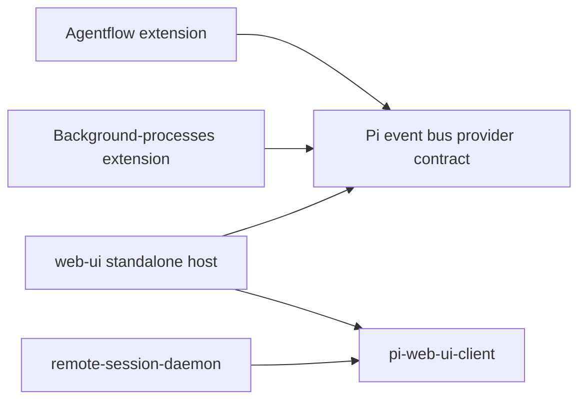

# Web UI and Shared Session UI Plan

## Scope and status

This plan owns two closely related deliverables:

1. **`web-ui` standalone companion** — the Pi extension that attaches a browser to a user-started TUI or RPC process.
2. **Reusable session UI package** — the host-neutral browser client, wire schemas, renderer fixtures, and styles that the standalone extension and the future daemon-hosted dashboard will both consume.

The separate managed-daemon implementation plan is [`../../../apps/remote-session-daemon/PLAN.md`](../../../apps/remote-session-daemon/PLAN.md). The cross-machine architecture and rationale remain in [`docs/RPC_FIRST_REMOTE_DASHBOARD.md`](docs/RPC_FIRST_REMOTE_DASHBOARD.md). Migration from the current dotfiles checkout into a dedicated `~/.pi` repository is specified in [`../../../../PI_SETUP_REPO_MIGRATION_PLAN.md`](../../../../PI_SETUP_REPO_MIGRATION_PLAN.md) and must happen before shared-package extraction.

The extension roadmap continues now, in parallel with eventual daemon work. The immediate priority is to establish a reusable client boundary before adding several more features to the current monolithic browser entry.

## Product direction

`agent/extensions/web-ui/` remains the canonical product definition for the Pi session UI in the dedicated `~/.pi` repository:

- its HTML-exporter-derived transcript is the desired visual design;
- its compact single-session layout, composer, disclosure behavior, and keyboard interactions are product requirements;
- it remains independently useful without the daemon;
- new session UI features should be proven here first when public extension APIs can support them;
- the daemon will reuse the same browser client rather than recreate the transcript UI.

The archived `agent/extensions/web-ui-old/` remains a donor of bounded algorithms, fixtures, and implementation lessons. Do not adopt its application shell, navigation model, WebSocket architecture, or visual hierarchy wholesale.

## Repository and package layout

### Decision

After migration, `~/.pi` is the dedicated Git repository root and Pi continues to use the ordinary `~/.pi/agent` path without symlinks or environment overrides:

```text
~/.pi/
  .git/
  .gitignore
  AGENTS.md                         repository development guidelines
  package.json                      root Nub workspace and aggregate scripts
  nub.lock
  tsconfig.json

  agent/
    AGENTS.md                       global instructions for every Pi session
    settings.json
    instructions/
    skills/
    themes/
    prompts/
    extensions/
      web-ui/
        package.json
        src/
          index.ts                  Pi registration and lifecycle
          standalone/              auth, HTTP/SSE, projection, completion, providers
          web/main.ts               shared client + standalone transport
        test/
        e2e/
      web-ui-old/                   archived donor
      agentflow/
      background-processes/

  packages/
    pi-web-ui-client/               host-neutral shared browser package
      package.json
      src/
        wire/                       schemas, DTOs, protocol limits
        client/                     reducers, components, renderers, preferences
        testing/                    golden fixtures and expected reducer states
        styles.css
      test/

  apps/
    remote-session-daemon/
      package.json
      src/                          RPC host and managed browser adapter
      test/
      service/
      PLAN.md
```

Provisional package name:

```text
@dotfiles/pi-web-ui-client
```

The root workspace should include at least:

```json
{
  "private": true,
  "workspaces": [
    "agent/extensions/web-ui",
    "agent/extensions/agentflow",
    "agent/extensions/background-processes",
    "packages/*",
    "apps/*"
  ]
}
```

Both consumers use the workspace package:

```json
"@dotfiles/pi-web-ui-client": "workspace:*"
```

Verify Nub's workspace install/filter/build behavior during migration before freezing scripts. Keep package-level checks even though installation and aggregate orchestration move to the repository root.

### Why not put shared code inside the extension?

Having the daemon import the `web-ui` extension directly would invert ownership: a system service would depend on a Pi extension package, its Pi peer dependencies, and its deployment lifecycle. Explicit exports would reduce accidental deep imports but would not fix that coupling.

The shared package is therefore outside both hosts. The extension and daemon depend on it; it depends on neither.

### Why not put the daemon under `.pi/agent/extensions/`?

The daemon is a machine-level service, not a Pi extension. It owns process supervision, local policy, Tailscale ingress, persistence, and multiple Pi children. Keeping it at `apps/remote-session-daemon/` makes its deployment and security boundary explicit and prevents Pi from treating it as session-scoped code.

### Why the root workspace now makes sense

The dedicated repository exists specifically to develop and deploy this Pi setup. Unlike the broader dotfiles repository, coordinated installation and checks are the desired behavior here. A root workspace removes cross-repository `file:` dependencies while package manifests preserve ownership and independently runnable checks.

## Dependency direction



Hard dependency rules:

- the shared package imports no Pi APIs, Pi extension modules, Node HTTP/process APIs, Tailscale code, daemon code, or provider runtime instances;
- the extension imports the shared package but never daemon code;
- the daemon imports the shared package but never the `web-ui` extension, Agentflow runtime classes, or background-process runtime classes;
- Agentflow/background-processes retain their cooperative Pi event-bus provider registration;
- only bounded serialized provider DTOs and action names cross into the browser protocol;
- a future daemon-side bridge is added only for a proven RPC-invisible capability.

## Ownership boundaries

### Shared package owns

- protocol version and runtime-validated browser wire schemas;
- shared browser-facing limits where both producers must agree;
- persisted-entry and live-tail DTOs;
- generation, revision, reset, history-page, and command-response envelopes;
- image and omission-placeholder DTOs;
- provider snapshot/action DTOs, but not provider callbacks or runtimes;
- browser reducer and session view model;
- transcript, composer, status, palette, modal, and renderer components;
- Markdown sanitization and URL policy;
- preferences and keyboard behavior that are session-UI concerns;
- canonical stylesheet and theme-variable consumption;
- deterministic hostile-content, renderer, reducer, and protocol fixtures;
- host-neutral `SessionTransport` interface.

Conceptually:

```ts
interface SessionTransport {
  connect(options: { generation?: string; revision?: number }): AsyncIterable<SessionOperation>;
  getHistory(cursor?: string): Promise<HistoryPage>;
  submit(command: SessionCommand): Promise<CommandAcceptance>;
  complete(query: CompletionQuery): Promise<CompletionResult>;
  close(): void;
}
```

The exact API may differ after implementation experience, but the browser must not know whether data came from Extension APIs, RPC events, or session JSONL.

### Standalone extension owns

- Pi extension registration and session-scoped lifecycle;
- Pi/session projection into shared DTOs;
- loopback HTTP serving and static asset delivery;
- standalone fragment bootstrap and cookie authentication;
- exact Origin checks and standalone authorization;
- standalone Tailscale Serve convenience;
- Pi public APIs for prompt, steer, follow-up, abort, model, thinking, and images;
- `@` completion adapters;
- Pi event-bus provider discovery/subscription/actions;
- extension-runtime generation and cleanup;
- the managed-child no-op marker.

### Daemon owns

See [`apps/remote-session-daemon/PLAN.md`](../../../apps/remote-session-daemon/PLAN.md). In particular it owns RPC, process lifecycle, managed identity/roles/leases, discovery, persistence, history indexing, and RPC/session projection into the same shared DTOs.

### Each consumer owns its browser bundle

The shared package is build input, not a separately served asset origin.

- The extension produces and serves its own production browser bundle.
- The daemon produces and serves its own production browser bundle.
- Both bundles mount the same shared client and stylesheet with different transport adapters.
- No runtime browser import may escape to a repository-relative path.
- Clean-checkout and deployment-like tests must prove that final assets are self-contained and CSP-compatible.

Choose one explicit artifact policy after the build spike:

1. reliable package-level build/prepare during dotfiles installation; or
2. committed production artifacts with a freshness check.

Do not leave deployment dependent on an undocumented manual build.

## Current baseline

`web-ui` already provides:

- loopback-only ephemeral HTTP serving under a random path;
- one-use fragment bootstrap credentials and path-scoped `HttpOnly; SameSite=Strict` cookies;
- authenticated full active-branch snapshots over SSE;
- bounded prompt, steer, follow-up, and completion POSTs;
- canonical `@` file completion where available;
- responsive desktop/mobile composer behavior;
- HTML-exporter-derived messages, thinking, Markdown, tools, compactions, model switches, and custom messages;
- tailored Agentflow/background/custom-tool transcript rendering;
- session-scoped Tailscale Serve in standalone mode;
- clean session shutdown and Playwright coverage.

Known gaps:

- the browser entry and server remain too monolithic for safe shared extraction;
- CDN browser dependencies prevent strict production CSP and offline use;
- full-snapshot SSE is not viable for sustained large sessions;
- history is not paged and transcript rows are not virtualized;
- browser client/state/renderers are not reusable by the daemon;
- user-message images, attachments, questionnaire results, syntax highlighting, notifications, model selection, status dashboards, and rich diffs remain incomplete;
- custom read/write/edit tool expansion needs restoration;
- standalone executable slash dispatch remains unavailable through stock `ExtensionAPI`.

## Design principles

1. **Preserve appearance while moving code.** Do not combine extraction with a visual redesign.
2. **One session UI, two host adapters.** Share presentation and protocol; keep standalone and managed backend behavior separate.
3. **Runtime validation at host boundaries.** TypeScript types alone do not make extension and daemon producers semantically equivalent.
4. **Bound hostile data before rendering.** Model text, tool details, paths, images, custom entries, provider snapshots, and URLs are untrusted.
5. **Prefer operations over snapshots.** Initial/reset snapshots are bounded; durable appends and replaceable live state are incremental.
6. **Keep Pi semantics in Pi.** The extension uses public APIs; the daemon uses canonical RPC. The client never parses slash commands into behavior.
7. **Provider DTOs, not provider runtimes.** Agentflow/background ownership remains in their extensions.
8. **No premature generic framework.** Create modules and abstractions only for actual independent responsibilities or test seams.
9. **Standalone remains first-class.** The shared extraction must not require the daemon to run.
10. **Managed children serve no extension web UI.** `web-ui` must no-op when launched under the daemon marker.

## Implementation phases

### Phase 0 — restore and freeze the baseline

- [x] Format `docs/SSE_TRAFFIC_ANALYSIS.md` and keep `nub run check` green.
- [ ] Record representative transcript/composer screenshots and DOM semantics.
- [ ] Add deterministic fixtures for:
  - user and assistant Markdown;
  - thinking blocks;
  - built-in and custom tools;
  - Agentflow/background tool output;
  - custom messages;
  - model/thinking changes;
  - compaction and branch summaries;
  - long paths and hostile HTML/URLs.
- [ ] Add a multi-thousand-entry large-session fixture.
- [ ] Add explicit lifecycle tests for reload/new/resume/fork cleanup and stale runtime generations.
- [ ] Restore custom read/write/edit tool expansion before using current screenshots as the parity baseline.

Exit criteria:

- aggregate checks pass;
- visual and semantic references exist;
- existing behavior can be moved without relying on memory or subjective comparison.

### Phase 1 — modularize inside the extension

Reorganize behavior-preservingly before extracting a package:

```text
src/
  index.ts
  standalone/
    server/
      index.ts
      auth.ts
      config.ts
      routes.ts
      sse.ts
      history.ts
    projection/
      snapshot.ts
      entries.ts
      live.ts
      images.ts
    completion/
    providers/
    transport/
  web/
    main.ts
    standalone-transport.ts
  shared-candidate/
    wire/
    client/
    testing/
    styles.css
```

`shared-candidate/` is temporary and exists to prove the import boundary before moving files to `packages/pi-web-ui-client`.

- [ ] Split server auth, routing, SSE clients, projection, completion, and providers.
- [ ] Split browser transport/state from components/renderers.
- [ ] Move specialized tool renderers into named modules.
- [ ] Centralize common tool shell, expansion, Markdown, truncation, and path wrapping.
- [ ] Make reducer and renderer fixtures runnable without HTTP or Pi.
- [ ] Preserve DOM structure, class names, accessible names, hotkeys, scroll behavior, and CSS output.
- [ ] Keep all long-lived extension resources inside `session_start`/`session_shutdown` ownership.

Exit criteria:

- behavior and visual references remain stable;
- host-neutral candidates contain no Pi/Node/Tailscale imports;
- standalone server and browser transport are explicit adapters.

### Phase 2 — local bundling and shared-package extraction

#### 2A. Bundling spike

- [ ] Add pinned local Preact, HTM or JSX equivalent, Marked, DOMPurify, and only justified dependencies.
- [ ] Choose the smallest supported bundler based on the existing package ecosystem.
- [ ] Produce one local production browser bundle and stylesheet.
- [ ] Remove esm.sh runtime imports.
- [ ] Add strict CSP, `X-Content-Type-Options: nosniff`, and `Referrer-Policy: no-referrer`.
- [ ] Preserve relative URLs and arbitrary standalone base paths.
- [ ] Verify offline loading and no runtime repository-relative imports.

#### 2B. Local dependency spike

- [ ] Create `packages/pi-web-ui-client` with its own `package.json`, `nub.lock`, and checks.
- [ ] Verify clean root workspace install plus filtered shared-package and extension checks using the proposed `workspace:*` dependency.
- [ ] Decide whether package exports point to source build inputs or generated `dist`, based on Nub/bundler behavior.
- [ ] Add a narrow exports map; prohibit deep imports.

Proposed exports:

```json
{
  "exports": {
    "./wire": "...",
    "./client": "...",
    "./styles.css": "...",
    "./testing": "..."
  }
}
```

#### 2C. Extraction

- [ ] Move only host-neutral wire schemas, limits, reducer, components, renderers, preferences, fixtures, and styles.
- [ ] Keep Pi projection, HTTP, auth, completion, provider callbacks, and lifecycle in the extension.
- [ ] Mount the shared client from `src/web/main.ts` using `StandaloneSessionTransport`.
- [ ] Validate all incoming browser wire data at the boundary.
- [ ] Add import-boundary checks preventing Pi, Node HTTP/process, Tailscale, and daemon imports in the shared package.
- [ ] Add a deployment-like extension test from a clean checkout/install.

Exit criteria:

- extension behavior and appearance remain unchanged;
- shared package checks independently;
- the extension consumes only public shared-package exports;
- final browser assets are self-contained.

### Phase 3 — shared wire protocol and scalable transcript

#### 3A. Versioned operation protocol

- [ ] Define runtime schemas for snapshot, append, live-tail, metadata, queue, reset, command response, completion, and error envelopes.
- [ ] Give each host runtime a generation and each semantic update a monotonic revision.
- [ ] Require revision continuity; issue a bounded reset on gaps.
- [ ] Give live assistant/tool overlays stable identities.
- [ ] Remove generated timestamps from semantic freshness checks.
- [ ] Distinguish accepted command responses from eventual operation completion.

#### 3B. Incremental SSE and backpressure

- [ ] Send full snapshots only for initial attach, reset, unsupported transitions, or recovery.
- [ ] Append immutable persisted entries once.
- [ ] Replace only live assistant/tool state while streaming.
- [ ] Send metadata, queue, theme, and running state independently.
- [ ] Bound each client by queued frame count and bytes.
- [ ] Coalesce replaceable operations and reset/disconnect when durable continuity is lost.
- [ ] Never await browser drains inside Pi event handlers.
- [ ] Instrument frame bytes/count, reason, serialization time, coalescing, reset, disconnect, parse time, and render time.

#### 3C. History and virtualization

- [ ] Put a bounded latest active-branch window in initial/reset snapshots.
- [ ] Add an authenticated older-history endpoint with opaque cursors and generation checks.
- [ ] Bound pages by entry count and projected bytes.
- [ ] Prepend without gaps, duplicates, or scroll jumps.
- [ ] Introduce stable row keys independent of array position.
- [ ] Virtualize transcript rows only.
- [ ] Preserve thinking/tool expansion through virtual unmount/remount.
- [ ] Preserve bottom-follow and scroll-to-bottom behavior.
- [ ] Test multi-thousand-entry sessions, branch resets, old cursors, and live growth.

Exit criteria:

- browser work is bounded independently of total session size;
- shared reducer fixtures can replay extension and future daemon operation streams;
- transport loss recovers by reset rather than corrupting state.

### Phase 4 — portable renderer and display features

These features can proceed in parallel after Phase 2 establishes shared renderer ownership. Each feature must use shared DTOs and fixtures rather than raw Pi objects.

#### 4A. Remote-safe images

- [ ] Define shared image and explicit omission-placeholder DTOs.
- [ ] Render images in user messages and supported tool results.
- [ ] Bound MIME type, image count, encoded bytes, and accepted display dimensions.
- [ ] Never silently drop unsupported, malformed, oversized, or history-omitted images.
- [ ] Keep base64 out of logs, search text, completion state, diagnostics, and telemetry.
- [ ] Test snapshot, append, history, reset, virtualization, Tailscale, malformed input, and CSP behavior.

#### 4B. Questionnaire result rendering

- [ ] Normalize questionnaire arguments/results into shared browser DTOs.
- [ ] Render question count, labels, choices, selected/custom answers, cancellation, running, and errors.
- [ ] Keep this transcript-only initially.
- [ ] Do not imply support for remotely answering arbitrary `ctx.ui.custom()` interactions.
- [ ] Preserve the actual questionnaire tool's local Herdr lifecycle.

#### 4C. Syntax highlighting

- [ ] Port the richer extension's selective Highlight.js core registry.
- [ ] Use existing Pi theme variables and preserve Markdown spacing.
- [ ] Render unknown languages safely as plain text.
- [ ] Add a synchronous-size cutoff for large code blocks.
- [ ] Add hostile-language-label and large-block fixtures.

#### 4D. Diff rendering

- [ ] First adapt the safe bounded unified-diff renderer from the richer extension.
- [ ] Preserve plain-text fallback and virtualization.
- [ ] Evaluate `@pierre/diffs` only for a demonstrated side-by-side/navigation requirement.
- [ ] Bound file count, hunk count, line length, and total projected bytes.

Exit criteria:

- these render identically under a mock transport and the standalone extension;
- no feature imports Pi or daemon runtime code into the shared package.

### Phase 5 — portable interactive features

These share UI and command envelopes, but each host adapter executes them differently.

#### 5A. Image attachments

- [ ] Add bounded picker, paste, and drop support.
- [ ] Preview and remove attachments before submission.
- [ ] Define shared draft/attachment state and image command DTOs.
- [ ] Enforce count, MIME, byte, and dimension limits before transport submission.
- [ ] Preserve exact draft and attachments on rejection; clear only after authoritative acceptance.
- [ ] Standalone adapter uses Pi's public image-capable message APIs.
- [ ] Future managed adapter uses RPC image-capable prompt/steer/follow-up commands.

#### 5B. Model and thinking controls

- [ ] Add a selector consistent with the command palette and `Opt-M` behavior.
- [ ] Keep browser components dependent only on shared model DTOs and command acceptance.
- [ ] Standalone adapter uses public Pi model/thinking APIs.
- [ ] Future managed adapter uses typed RPC operations.
- [ ] Update displayed state only from authoritative host state/events.
- [ ] Preserve draft/focus on rejection or stale generation.

#### 5C. Provider status and dashboards

- [ ] Add the compact status strip below the composer.
- [ ] Define bounded serialized Agentflow/background provider DTOs and revisions.
- [ ] Add read-only summary and drill-down components first.
- [ ] Keep provider subscriptions/actions in the standalone Pi event-bus adapter.
- [ ] Do not import Agentflow or background runtime classes into the shared package.
- [ ] Add actions only with explicit command IDs, generation checks, bounded arguments, and authoritative responses.
- [ ] Do not mark autonomous background work as Herdr blocked.

#### 5D. Command discovery UI

- [ ] Keep ordinary prompt/steer/follow-up behavior unchanged.
- [ ] Allow command-name discovery through `pi.getCommands()` if useful.
- [ ] Do not advertise executable standalone slash dispatch until Pi exposes a canonical extension API or a separately approved local-only design exists.
- [ ] Keep daemon RPC command discovery/execution outside the standalone adapter.

Exit criteria:

- components run against a mock host and standalone adapter;
- host-specific capabilities are negotiated explicitly rather than inferred from UI presence.

### Phase 6 — standalone hardening and managed-child guard

- [ ] Define one daemon-owned environment marker for managed children.
- [ ] When present, `web-ui` opens no HTTP listener, starts no Tailscale Serve process, registers no browser-control routes, and emits no URLs.
- [ ] Keep standalone startup limited to supported TUI/RPC modes and never write diagnostics to RPC stdout.
- [ ] Retain standalone random path, fragment bootstrap, cookie auth, exact Origin policy, and `frame-ancestors 'none'`.
- [ ] Test spoofed proxy/Tailscale headers having no standalone effect.
- [ ] Test partial startup, reload, new/resume/fork, and shutdown for resource leaks.
- [ ] Test standalone use when the shared package is installed but the daemon does not exist.
- [ ] Test managed no-op while Agentflow/background and other ordinary extensions still load.

Exit criteria:

- standalone remains independently deployable and secure;
- daemon-managed Pi children expose only RPC from this extension's perspective.

### Phase 7 — publish host-neutral conformance assets

This phase supports independent daemon conformance without importing or orchestrating daemon code from the extension/shared package.

- [ ] Publish/freeze versioned schemas and golden fixture streams with expected reducer states.
- [ ] Add a mock `SessionTransport` capable of rendering a complete session without Pi or HTTP.
- [ ] Cover messages/live deltas, tools, images/omissions, compactions, branches, model/thinking changes, queues/retries, provider DTOs, resets, and stale generations.
- [ ] Keep host differences explicit through capability flags rather than checks scattered through components.
- [ ] Run extension producer conformance against the published fixtures.
- [ ] Leave daemon projection/schema conformance and daemon bundle checks exclusively to `apps/remote-session-daemon/PLAN.md`.

## Browser notifications

Notifications are useful but should follow the stable client and host boundaries:

- [ ] Define host-neutral notification-worthy events such as settled, failed, question pending, and child unavailable.
- [ ] Notify only while the document is hidden/unfocused.
- [ ] Request permission from an explicit user action.
- [ ] Keep standalone ephemeral-origin notifications optional because permissions may repeat across ports/origins.
- [ ] Prefer the stable daemon origin for routine managed notifications.
- [ ] Do not add a service worker/PWA unless closed-page delivery becomes an explicit requirement.

## Testing strategy

### Shared package

- runtime schema acceptance/rejection;
- generation/revision reducer transitions;
- reset and history behavior;
- hostile Markdown/URL/image/tool payloads;
- renderer semantics and accessibility;
- preferences and keyboard ownership;
- deterministic mock-transport fixtures;
- import-boundary enforcement.

### Standalone extension

- Pi lifecycle and mode gating;
- authentication and exact Origin policy;
- SSE reconnect/backpressure/reset;
- input admission and draft preservation;
- history and completion endpoints;
- provider registration/subscription/action cleanup;
- managed-child no-op;
- deployment-like bundle loading below non-root paths;
- Playwright visual and behavior coverage.

### Cross-consumer contract

- both producers validate through the same runtime schemas;
- both operation streams produce the same reducer state for equivalent sessions;
- both render the same DOM/accessible behavior from equivalent fixtures;
- neither final bundle contains runtime paths into the other host package.

## Parallel execution map

### Sequential foundation

1. Phase 0 baseline and references.
2. Phase 1 internal modularization.
3. Phase 2 bundling and package extraction.
4. Phase 3 wire/scalability foundation.

Do not skip directly to feature additions inside the monolithic client; that would increase extraction cost and duplicate work.

### Parallel after Phase 2

Can proceed independently against shared DTOs and fixtures:

- images;
- questionnaire results;
- syntax highlighting;
- bounded diff rendering;
- status-strip visual components.

### Parallel after command envelopes stabilize

- attachments;
- model/thinking controls;
- provider actions;
- daemon managed transport and projection.

### Must remain sequential or gated

- virtualization follows stable row identity and history operations;
- provider actions follow read-only provider DTOs and command admission;
- notifications follow stable host origins/event semantics;
- generic RPC dialog answering follows a child-local Herdr lifecycle solution;
- executable standalone slash dispatch follows canonical Pi support or a separately approved design.

## Deferred or explicitly excluded

- process spawning, discovery, Tailscale identity, roles, leases, and persistence in the extension;
- daemon imports of extension or provider runtime code;
- central transcript proxying;
- session iframes and cross-frame `postMessage` protocols;
- generic JSON Patch, offline mutation, or collaborative editing;
- service workers without a closed-page notification requirement;
- arbitrary browser execution of TUI renderers or `ctx.ui.custom()`;
- direct exposure of provider runtime instances, credentials, abort controllers, or filesystem APIs;
- ad hoc cross-package imports that bypass root workspace package boundaries.

## Completion criteria

This plan is complete when:

- `packages/pi-web-ui-client` is an independently checked host-neutral package with narrow exports;
- `web-ui` consumes it through a verified workspace dependency and remains independently deployable as part of the dedicated setup repository;
- the extension uses bundled local assets, strict security headers, bounded incremental SSE, paged history, and transcript virtualization;
- visual identity, DOM semantics, keyboard behavior, scroll behavior, and accessibility remain stable;
- images, questionnaire results, syntax highlighting, attachments, model controls, provider status, and bounded diff rendering are implemented or explicitly deferred with fixtures;
- standalone authentication, lifecycle, Tailscale convenience, and command admission remain correct;
- managed children cause the extension to open no web resources;
- shared mock/contract fixtures allow the daemon to adopt the UI without copying client code;
- aggregate checks, deployment-like tests, and Playwright coverage pass.
