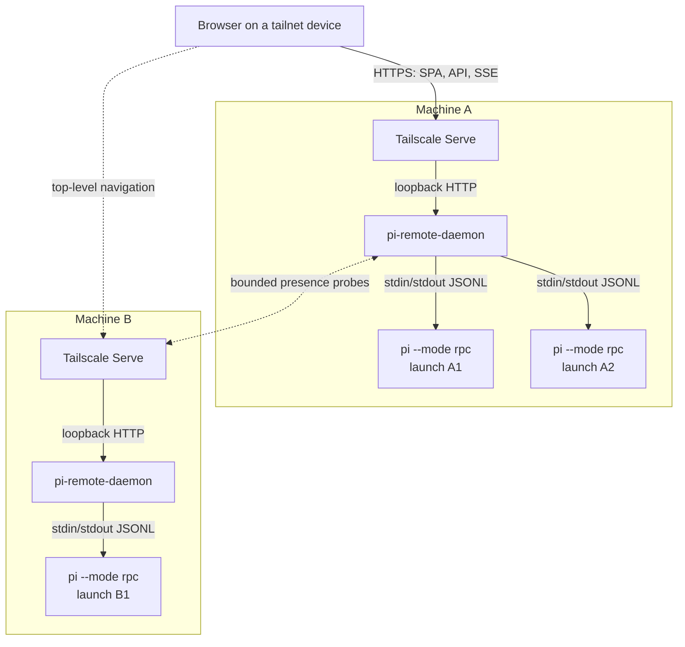
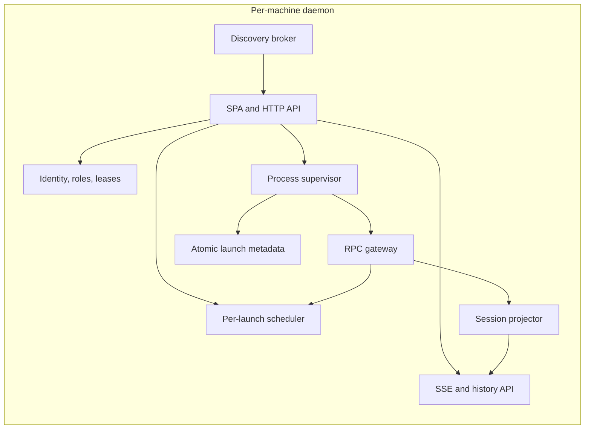
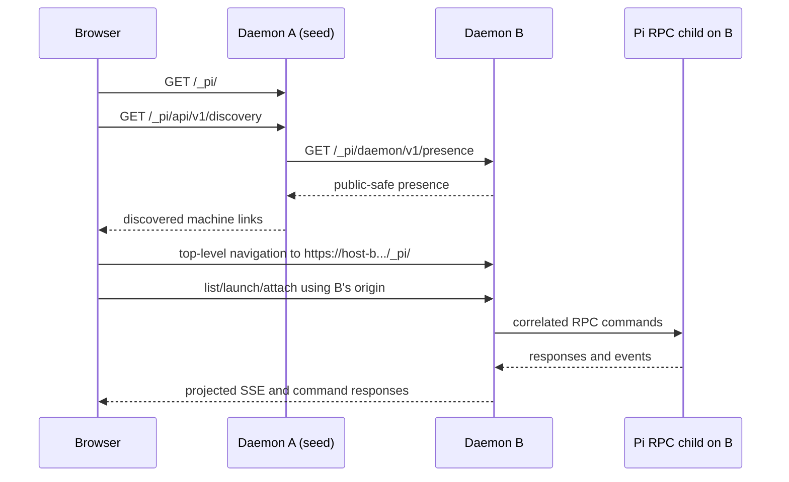
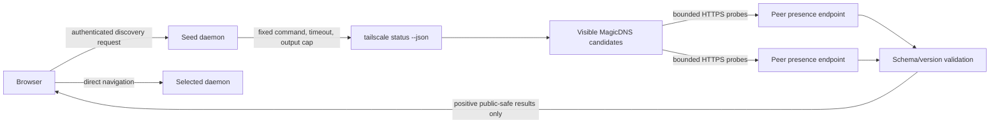
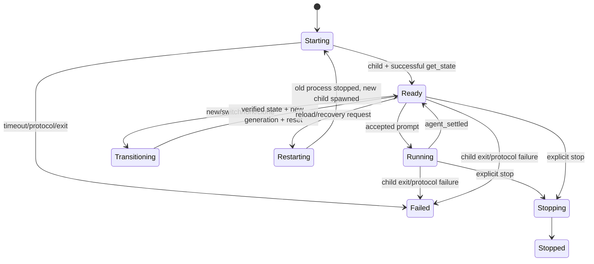

# RPC-first remote dashboard architecture

## Status

This document is the proposed source of truth for the **new cross-machine managed dashboard**. It supersedes the managed child-web-server, reverse-proxy, and iframe portions of [`REMOTE_SESSION_INFRA_PLAN.md`](./REMOTE_SESSION_INFRA_PLAN.md).

It does **not** replace the standalone `web-ui` extension or its roadmap. The extension remains the browser companion for a Pi process that the user started directly, especially an existing TUI session.

The central decision is:

> A managed session is owned by a per-machine daemon through one `pi --mode rpc` child. The daemon—not an extension inside that child—serves the dashboard, projects the transcript, authenticates browser requests, and brokers every mutation.

## Why the boundary changes

The previous managed design assumed that the session extension remained the browser backend. The daemon would launch an RPC child, discover the extension's ephemeral HTTP server, and reverse-proxy that server under a stable route.

RPC command research changes that tradeoff. A daemon-owned RPC channel already provides:

- canonical prompt, prompt-template, skill, and extension-command dispatch;
- typed model, thinking, queue, compaction, session, abort, and state operations;
- responses correlated by request ID;
- live message, tool, queue, retry, compaction, and lifecycle events;
- durable session entries and tree queries;
- standard extension UI requests and responses.

Once the daemon must be the sole RPC writer and parser, retaining a second child-owned HTTP backend duplicates the browser-facing control plane. It adds per-child ports, readiness FDs, proxy capabilities, header injection, endpoint churn, managed framing policy, and two independent projections of one session.

The extension boundary remains valuable for the other product mode: attaching a browser to a Pi/TUI process that the daemon does not own.

## Product modes

| Mode                   | Process owner      | Browser backend    | Control path          | Intended use                                             |
| ---------------------- | ------------------ | ------------------ | --------------------- | -------------------------------------------------------- |
| Standalone companion   | User/TUI           | `web-ui` extension | Public extension APIs | Attach a browser to an already-running local Pi process  |
| Managed remote session | Per-machine daemon | Per-machine daemon | Canonical Pi RPC      | Launch, resume, supervise, and control sessions remotely |

Feature parity is not a requirement. The standalone extension stays deliberately small; the managed dashboard can expose the richer RPC control surface.

## Repository and package boundary

Keep the three ownership domains explicit:

The dedicated repository is cloned directly as `~/.pi`; no symlink or Pi directory override is needed:

```text
~/.pi/
  AGENTS.md                                  repository development guidelines
  package.json                              root Nub workspace
  agent/
    AGENTS.md                               global Pi instructions
    extensions/web-ui/                      standalone HTTP/auth/projection adapter
  packages/pi-web-ui-client/                host-neutral UI, wire schemas, fixtures, styles
  apps/remote-session-daemon/               RPC host, managed projection, discovery, services
```

Both hosts depend on `@dotfiles/pi-web-ui-client` through `workspace:*`. The shared package depends on neither host and imports no Pi, Node HTTP/process, Tailscale, daemon, or provider-runtime code. Each host owns its final browser bundle and package-level checks, while the repository root owns installation and aggregate checks.

Do not make the daemon import the `web-ui` extension: that would make a machine service depend on a Pi extension's peer dependencies and deployment lifecycle. The dedicated repository is intentionally a root workspace because coordinated extension/shared/daemon changes are its purpose.

Agentflow and background-processes retain their Pi event-bus provider contracts. The standalone adapter translates their bounded snapshots/actions into shared browser DTOs. The daemon derives equivalent DTOs from RPC/session-visible state or a later explicit bridge; it never imports their runtime classes.

Implementation plans:

- [`../PLAN.md`](../PLAN.md) — standalone extension and shared client extraction;
- [`../../../../apps/remote-session-daemon/PLAN.md`](../../../../apps/remote-session-daemon/PLAN.md) — daemon implementation;
- [`../../../../../PI_SETUP_REPO_MIGRATION_PLAN.md`](../../../../../PI_SETUP_REPO_MIGRATION_PLAN.md) — one-time migration from the current dotfiles-owned symlink.

## Recommended topology



### One daemon per machine

The OS supervisor starts one unprivileged Node/TypeScript daemon:

- `systemd --user` on Linux;
- a LaunchAgent on macOS.

Tailscale and Tailscale Serve are externally managed system facilities, not per-session children. Each machine has one persistent Serve endpoint forwarding to the daemon's fixed loopback listener. Funnel is not used.

### One Pi process per managed launch

Each active launch owns exactly one child:

```text
pi --mode rpc [--session <validated-session-file>] [fixed validated options]
```

The daemon spawns it directly, without a shell or PTY, in a canonical approved cwd, with a curated environment and its own process group.

```text
fd 0  daemon-only RPC JSONL writer
fd 1  daemon-only strict LF JSONL parser
fd 2  continuously drained bounded diagnostics
```

There is no child HTTP listener, child Tailscale Serve process, reverse-proxy target, or required readiness FD.

Ordinary trusted user/project extensions may still load in the RPC child. `web-ui` must detect the managed launch marker and skip its HTTP/Tailscale startup. No managed bridge extension is mandatory for the first release.

## Daemon components



### Process supervisor

Owns:

- approved-root and project-trust policy;
- launch idempotency and capacity limits;
- subprocess groups and descriptor draining;
- startup, stop, crash, and replacement state machines;
- stable launch IDs and daemon-owned generations;
- restart-and-resume without prompt replay.

### RPC gateway

Owns:

- strict LF-only JSONL decoding with `StringDecoder` semantics;
- one parser for stdout and one writer abstraction for stdin;
- RPC request ID allocation and response correlation;
- hard line, queue, and diagnostic limits;
- protocol-desynchronization failure handling.

Browser clients never send or receive raw Pi RPC.

### Mutation scheduler

Each launch has two lanes:

1. **Ordinary lane** — one correlated mutation awaiting its authoritative RPC response at a time.
2. **Interrupt lane** — matching `extension_ui_response`, dialog cancellation, abort operations, and lifecycle stop. It may write while an ordinary command is waiting, but still takes the short byte-writer lock.

The writer lock covers one complete JSONL record only. It is never held while waiting for a response.

Every browser mutation is checked immediately before the write for:

- authenticated principal and role;
- current launch generation;
- controller lease where required;
- bounded schema and payload size;
- unique browser command ID/replay status;
- current launch admission state.

RPC `success: true` for a prompt means accepted, queued, or handled—not that the later model run succeeded. The daemon never retries after an ambiguous acceptance outcome.

### Session projector

Consumes RPC events and state queries and emits a bounded browser protocol rather than exposing raw Pi objects.

It owns:

- stable projected entry identities;
- live assistant/tool overlays;
- queue, retry, compaction, model, thinking, cost, and running state;
- monotonic revisions inside a generation;
- reset semantics after gaps, branch/session replacement, or recovery;
- hostile-content projection and explicit truncation/omission placeholders;
- bounded replay/coalescing for SSE clients.

Pi's session JSONL remains transcript truth. The daemon may hold rebuildable indexes and projected windows, but not a second durable transcript database.

### Browser server

Every daemon serves the same locally bundled SPA and its APIs under a stable base such as `/_pi/`:

```text
/_pi/                                  dashboard SPA
/_pi/api/v1/host                       local host identity/capabilities
/_pi/api/v1/discovery                  bounded daemon discovery
/_pi/api/v1/sessions                   local launch/session summaries
/_pi/api/v1/sessions/:launchId/events  projected SSE
/_pi/api/v1/sessions/:launchId/history bounded history pages
/_pi/api/v1/sessions/:launchId/command explicit commands
/_pi/api/v1/sessions/:launchId/dialog  dialog responses (later phase)
/_pi/daemon/v1/presence                public-safe daemon marker
```

The existing `web-ui` renderer, styles, reducers, sanitization, and future virtualization should be extracted into reusable client modules. The standalone extension and daemon-hosted SPA can share the visual client without sharing their backend or authentication model.

## Browser topology: no iframes

### First release

The browser stays same-origin with the daemon it is currently using.

1. Open any known daemon URL.
2. That daemon discovers other machines and shows a machine selector.
3. Selecting another machine performs a top-level navigation (or opens a new tab) to the same SPA on that machine's canonical HTTPS origin.
4. Session lists, transcript streams, dialogs, and mutations are then same-origin with the owning daemon.



This choice avoids:

- cross-origin iframe focus and keyboard ownership;
- `postMessage` coordination;
- third-party-cookie assumptions;
- frame-ancestor configuration churn;
- cross-origin dialog/modal layering;
- CORS on transcript and mutation APIs;
- a central transcript proxy or delegated-user-identity protocol.

All daemon and standalone pages default to `frame-ancestors 'none'`.

### Future fleet overview

A richer single-page fleet overview may need live session summaries from several machines. Do not make the seed daemon proxy private session summaries under its own machine identity: the target daemon would no longer be authorizing the real browser principal.

If the product proves that simultaneous cross-machine summaries are necessary, add a **separate read-only summary API** that supports browser-direct requests with:

- target-daemon authorization of the actual Tailscale user;
- finite exact dashboard-origin allowlists;
- narrow methods and headers;
- `Vary: Origin`;
- strict response schemas and byte limits;
- no transcript content or mutation support;
- bounded polling or one light summary stream per active machine.

Transcript streams and mutations remain same-origin with the owning daemon. A shared Tailscale Service may later improve bootstrap and notification-origin stability, but must not silently become a transcript/control proxy.

## Tailscale discovery

Tailscale supplies network reachability and authenticated Serve identity; it does not supply a browser peer-enumeration API.

Any daemon can act as the initial discovery seed:



Rules:

- candidate hosts come only from local Tailscale status, never browser input;
- tolerate unknown/missing status fields because the JSON shape is documented as subject to change;
- cap candidates, concurrency, timeout, redirects, body size, and cache lifetime;
- validate HTTPS, content type, exact kind marker, and supported protocol version;
- return no sessions, cwd values, users, models, roles, credentials, or capabilities from presence;
- label discovery as reachability evidence only;
- require the selected daemon to independently authorize the browser;
- keep generic unreachable diagnostics because policy, DNS, sleep, daemon outage, and host outage are not reliably distinguishable.

Suggested initial limits remain: 256 candidate peers, eight concurrent probes, 2–3 seconds per probe, 4 KiB presence bodies, 10–15 second cache, and 15–30 second browser refresh.

A manual host entry and cached last-known machine links remain bootstrap fallbacks. A Tailscale Service is a later option for one stable entry URL; it does not replace target discovery or target-side authorization.

## Authentication and authorization

Tailscale Serve terminates HTTPS and, for supported untagged tailnet users, supplies identity headers to the loopback HTTP backend. Official documentation says Serve strips incoming spoofed copies before adding its own headers.

Hard requirements:

- daemon HTTP listens on loopback only;
- trust `Tailscale-User-*` headers only under an explicit **local-host trust boundary**: Serve strips spoofed remote copies, but a process or another local user that can connect directly to the same TCP listener can forge the headers and Origin;
- the initial single-user deployment therefore treats code running on that host/account as trusted (same-account code can already read session files and control child processes);
- before supporting mutually untrusted local users, require a verified non-spoofable ingress such as OS-enforced listener isolation or an authenticated local proxy hop, and reject direct bypass traffic; loopback alone is insufficient;
- deny tagged/shared identities unless local policy maps them deliberately;
- combine Tailscale grants/ACLs with daemon application roles;
- exact-Origin validation on every mutation;
- no mutating GET routes;
- no wildcard CORS or origin reflection;
- launch IDs, session IDs, discovery, and Tailscale reachability are not authorization.

Initial roles:

- `viewer` — list and view authorized local sessions;
- `controller` — prompt, steer, follow-up, abort, model, thinking, and dialog responses;
- `launcher` — launch/resume inside approved roots;
- `operator` — stop launches and inspect bounded health.

Allow many viewers and one renewable controller lease per launch. Lease loss, generation change, authorization loss, or daemon restart invalidates control. A takeover policy can start simple, but every mutation is rechecked immediately before RPC write.

Remote control is code execution as the daemon's Unix account. Approved cwd roots are launch policy, not a filesystem sandbox. Mutually untrusted users or repositories need OS-account, container, or VM isolation.

## Identity, lifecycle, and generation model

Use distinct identifiers:

| Identifier                  | Lifetime               | Purpose                                                               |
| --------------------------- | ---------------------- | --------------------------------------------------------------------- |
| `daemonId`                  | installation           | Stable daemon identity for discovery                                  |
| `daemonBootId`              | daemon process         | Detect daemon restart                                                 |
| `launchId`                  | managed launch slot    | Stable browser/API route; never a credential                          |
| `processEpoch`              | Pi child process       | Changes on spawn/respawn                                              |
| `sessionEpoch`              | active Pi session/view | Changes on new/switch/fork/clone or conservative reconciliation reset |
| `generation`                | opaque client token    | Combines current process/session epochs                               |
| `revision`                  | one generation         | Monotonic projected browser operation sequence                        |
| `sessionId` / `sessionFile` | Pi session             | Transcript identity and recovery source, not authorization            |



### Readiness

The first release uses stock RPC:

1. spawn the child;
2. start strict stdout parsing and stderr draining immediately;
3. issue a correlated `get_state` under a startup deadline;
4. for a resumed launch, start with `--session <validated-path>` or verify a typed `switch_session` result;
5. verify the expected persisted session identity;
6. publish the generation as ready.

`get_commands` and initial history reconciliation follow readiness but are not themselves readiness gates.

### Session replacement

For daemon-issued `new_session`, `switch_session`, `fork`, or `clone`:

1. mark the launch transitioning and fence ordinary admission;
2. serialize the typed RPC command;
3. honor cancellation explicitly;
4. query and verify new state/history/commands;
5. increment `sessionEpoch`;
6. publish one reset snapshot under the new generation.

Conservatively reconcile after extension commands because a trusted command can alter session/runtime state outside the daemon's typed route.

### Reload

Define managed “reload” initially as supervised process replacement, not an extension-command bridge:

1. require idle, no compaction, no pending queue, and no unresolved dialog by default;
2. fence admission and invalidate the old generation;
3. gracefully stop the old process group under a deadline;
4. spawn a fresh RPC child with the same validated cwd/config and last confirmed session;
5. wait for `get_state` verification;
6. publish a new generation and reset.

This unifies reload with crash/reboot recovery and avoids a second ambiguous in-process lifecycle. It intentionally loses volatile extension globals and queues. Never replay an uncertain prompt. If Pi later exposes typed RPC reload with an explicit completion boundary, reconsider this decision.

## Transcript and history

### Live projection

Use RPC events for the live tail and status. `agent_settled`, not `agent_end`, is the authoritative fully-idle boundary. Reconcile durable entries after completed turns and at uncertainty boundaries using `get_entries(since=<known-entry-id>)` only when the expected suffix is bounded.

SSE clients receive a small operation protocol:

- initial/reset bounded snapshot;
- durable append operations;
- replaceable live assistant/tool tail;
- metadata/status/queue operations;
- generation and monotonic revision on every frame.

Slow clients never backpressure child stdout. Per-client byte/count queues coalesce replaceable operations; loss of durable continuity produces one reset, and a client that cannot accept the reset is disconnected.

### Cold history and the unpaginated RPC gap

`get_entries` is cursor-based only in the forward direction and has no count/byte limit. It is not a safe long-term backward-paging API for arbitrarily large resumed sessions.

Keep that limitation behind the daemon's opaque history API:

1. **Fidelity/size spike:** compare RPC entries/events against the current extension projector using representative sessions, including custom messages, tools, images, compactions, branches, model changes, and large outputs.
2. **Bounded MVP:** permit full `get_entries` only under a measured hard RPC-line/session limit. Project immediately; show an explicit degraded-history state instead of accepting unbounded memory.
3. **Production paging:** build a disposable, version-checked index over the exact validated Pi session JSONL file. Store compact entry metadata and file offsets; seek/project bounded pages on demand. Enforce file, line, entry, page, image, and projected-byte limits and explicit omission placeholders.
4. **Upstream replacement:** if Pi adds bounded backward history RPC, replace the internal index without changing the browser history API.

Direct session-file reading is a documented-format coupling and must be covered by fixtures for every supported Pi version. Pi JSONL remains source of truth; the index is disposable and rebuilt after mismatch.

## Extension UI dialogs and Herdr

RPC can transport `select`, `confirm`, `input`, and `editor` requests and matching responses. `ctx.ui.custom()` remains unavailable.

Phase 1 cancels unsupported blocking dialogs promptly so an unattended child cannot hang. Generic browser answering is enabled only after all of these exist:

- scope to launch, generation, RPC request ID, controller principal/lease, and deadline;
- exactly one terminal response;
- interrupt-lane response/cancellation that cannot deadlock behind the invoking command;
- cancellation on timeout, lease loss, takeover, abort, reload, replacement, exit, and daemon shutdown;
- rejection of late and duplicate responses;
- a child-local mechanism proving balanced `herdr:blocked` active/inactive events in `finally` for every completion and exceptional path.

Autonomous daemon/RPC/browser work is never marked Herdr blocked.

## Persistence and recovery

Persist small owner-only metadata atomically:

- daemon identity;
- launch ID and creator;
- root alias plus relative path and canonical validation data;
- desired running/stopped state;
- launch idempotency records;
- last confirmed Pi session ID/file;
- bounded timestamps and recovery status.

Do not persist:

- controller leases;
- prompts, transcript replicas, raw RPC events, or tool output;
- credentials or Tailscale identity headers;
- ambiguous commands for replay.

On daemon restart, revalidate cwd, root containment, project trust, and session ownership. Start a fresh idle RPC child for a launch whose desired state is running and resume only the last confirmed session. Do not adopt unknown orphans, replay kickoff prompts, or automatically resume interrupted model work.

## Security and reliability invariants

1. Exactly one parser of RPC stdout and one writer abstraction for RPC stdin per child.
2. Browser slowness never blocks child descriptor draining.
3. No browser value becomes an executable, shell string, arbitrary Pi flag, environment entry, absolute cwd/session path, discovery target, or proxy destination.
4. Every mutation is independently authenticated, authorized, Origin-checked, generation-checked, lease-checked where required, replay-checked, and bounded.
5. No automatic retry follows an ambiguous RPC acceptance.
6. Reload/session replacement never accepts work for the old generation.
7. Presence proves only daemon reachability; the selected daemon authorizes the user again.
8. Secrets and transcript content do not enter discovery, URLs, browser storage, `postMessage`, or ordinary logs.
9. All parsers, lines, queues, clients, bodies, projections, images, logs, probes, launches, and rates have hard limits.
10. Protocol-invalid or oversized child output fails closed rather than continuing after desynchronization.
11. Managed pages and standalone pages are non-frameable by default.
12. Local bundled assets, strict CSP, `nosniff`, `no-referrer`, hostile Markdown sanitization, and URL-scheme allowlisting are required before remote mutation ships.
13. Tailscale ACL/grant success, identity-header presence, launch-ID possession, and approved cwd are never treated as complete authorization or sandboxing.
14. Tailscale identity headers do not defend against a local process that bypasses Serve and reaches the backend directly; the single-user local-host trust assumption or a separately verified authenticated ingress is mandatory.

## Architecture milestone map

The actionable daemon checklist lives only in [`apps/remote-session-daemon/PLAN.md`](../../../../apps/remote-session-daemon/PLAN.md). At the architecture level, the milestones are:

1. **Contracts and feasibility** — freeze browser envelopes, publish shared UI fixtures, measure RPC/history bounds, and verify Tailscale identity/SSE behavior.
2. **Local host core** — supervise one RPC child with strict framing, stock-RPC readiness, mutation scheduling, and bounded failure behavior.
3. **Managed session view** — consume the extracted shared client through a managed transport and RPC/session projector; do not copy or port the renderer roadmap into the daemon.
4. **History and lifecycle** — add bounded paging/indexing, typed session transitions, process-replacement reload, and crash recovery.
5. **Remote security and discovery** — gate mutation on target-side identity, roles, Origin, generation, lease, and replay checks; then add presence probing and direct navigation.
6. **Optional interactions** — add Herdr-safe dialogs, notifications, shared bootstrap, or read-only fleet summaries only after their explicit gates are met.

## Removed managed work

The RPC-first design removes these requirements from managed children:

- child-owned HTTP/SSE servers;
- per-child ephemeral ports and reverse proxy routes;
- readiness FD records for child web endpoints;
- per-child proxy capabilities and injected principals;
- managed extension authentication and role enforcement;
- managed child base-path and framing configuration;
- cross-origin session iframes and `postMessage` hotkey/focus bridges;
- extension-command reload as a required control path.

Standalone base-path correctness, bundling, CSP, transcript scalability, rendering, input, images, and extension lifecycle tests remain valuable and continue on the extension roadmap.

## Revisit conditions

Reconsider parts of this architecture only when a concrete requirement changes:

- add an optional bridge extension if a committed feature cannot be derived from RPC/events/validated session data;
- replace respawn reload when typed RPC reload has a reliable completion event;
- replace the JSONL index when bounded backward-history RPC exists;
- add exact-origin read-only cross-machine summary CORS when users need a simultaneous fleet view;
- add a central proxy only for an explicit central archival/search/audit product, with a new delegation, confidentiality, and availability design;
- use containers, VMs, or separate users when mutually untrusted workloads must share a host;
- reconsider SSE only after measured bidirectional/high-rate needs exceed SSE plus POST.

## Decision summary

- Keep `web-ui` as the standalone companion and continue its README roadmap.
- Do not run its web server in daemon-managed children.
- Build one Node/TypeScript daemon per machine and one `pi --mode rpc` process per managed launch.
- Let the daemon be the sole RPC controller and browser backend.
- Reuse the simple UI's client design and renderer in a daemon-served SPA.
- Serve that SPA from every daemon.
- Auto-discover peers server-side, then navigate the browser directly to the selected daemon.
- Do not use session iframes in the target architecture.
- Keep transcript traffic and mutations on the owning machine.
- Start without a managed bridge extension; add one only for a measured RPC gap.
