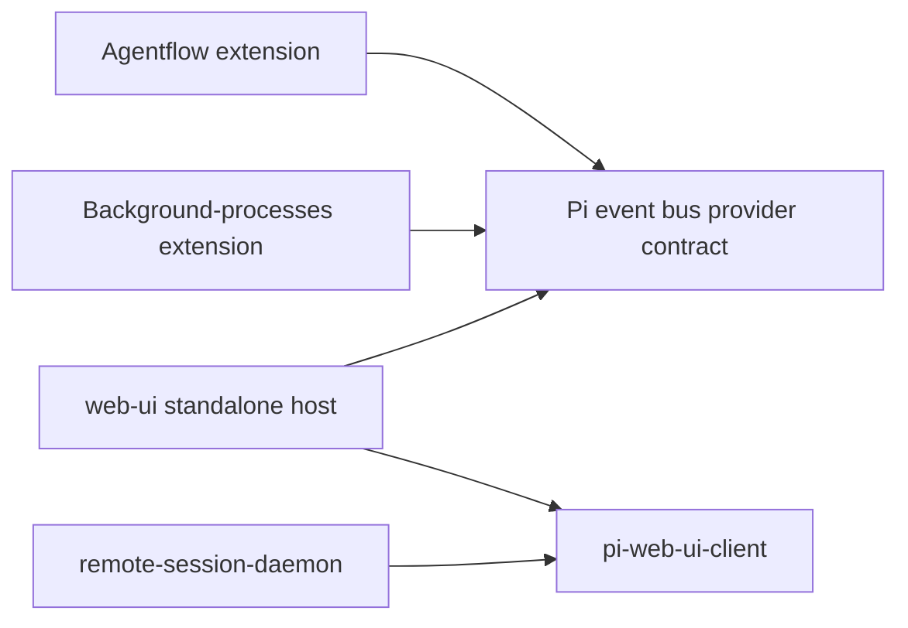

# Web UI and Shared Session UI Plan

## Scope and status

This plan owns two closely related deliverables:

1. **`web-ui` standalone companion** — the Pi extension that attaches a browser to a user-started TUI or RPC process.
2. **Reusable session UI package** — the host-neutral browser client, wire schemas, renderer fixtures, and styles that the standalone extension and the future daemon-hosted dashboard will both consume.

The separate managed-daemon implementation plan is [`../../../apps/remote-session-daemon/PLAN.md`](../../../apps/remote-session-daemon/PLAN.md). The cross-machine architecture and rationale remain in [`docs/RPC_FIRST_REMOTE_DASHBOARD.md`](docs/RPC_FIRST_REMOTE_DASHBOARD.md). The dedicated `~/.pi` repository is now the root workspace for shared-package extraction.

The extension roadmap continues now, in parallel with eventual daemon work. The immediate priority is to establish a reusable client boundary before adding several more features to the current monolithic browser entry.

In this document, a **data transfer object (DTO)** is a bounded, serializable data structure used to pass data across component or process boundaries without carrying runtime behavior such as callbacks.

## Product direction

`agent/extensions/web-ui/` remains the canonical product definition for the Pi session UI in the dedicated `~/.pi` repository:

- its HTML-exporter-derived transcript is the desired visual design;
- its compact single-session layout, composer, disclosure behavior, and keyboard interactions are product requirements;
- it remains independently useful without the daemon;
- new session UI features should be proven here first when public extension APIs can support them;
- the daemon will reuse the same browser client rather than recreate the transcript UI.

The archived `agent/extensions/web-ui-old/` remains a donor of bounded algorithms, fixtures, and implementation lessons. Do not adopt its application shell, navigation model, WebSocket architecture, or visual hierarchy wholesale.

## Repository and package layout

### Decision

After migration, `~/.pi` is the dedicated Git repository root and Pi continues to use the ordinary `~/.pi/agent` path without symlinks or environment overrides:

```text
~/.pi/
  .git/
  .gitignore
  AGENTS.md                         repository development guidelines
  package.json                      root Nub workspace and aggregate scripts
  nub.lock
  tsconfig.json

  agent/
    AGENTS.md                       global instructions for every Pi session
    settings.json
    instructions/
    skills/
    themes/
    prompts/
    extensions/
      web-ui/
        package.json
        src/
          index.ts                  Pi registration and lifecycle
          standalone/              auth, HTTP/SSE, projection, completion, providers
          web/main.ts               shared client + standalone transport
        test/
        e2e/
      web-ui-old/                   archived donor
      agentflow/
      background-processes/

  packages/
    pi-web-ui-client/               host-neutral shared browser package
      package.json
      src/
        wire/                       schemas, DTOs, protocol limits
        client/                     reducers, components, renderers, preferences
        testing/                    golden fixtures and expected reducer states
        styles.css
      test/

  apps/
    remote-session-daemon/
      package.json
      src/                          RPC host and managed browser adapter
      test/
      service/
      PLAN.md
```

Provisional package name:

```text
@dotfiles/pi-web-ui-client
```

The root workspace should include at least:

```json
{
  "private": true,
  "workspaces": [
    "agent/extensions/web-ui",
    "agent/extensions/agentflow",
    "agent/extensions/background-processes",
    "packages/*",
    "apps/*"
  ]
}
```

Both consumers use the workspace package:

```json
"@dotfiles/pi-web-ui-client": "workspace:*"
```

Verify Nub's workspace install/filter/build behavior during migration before freezing scripts. Keep package-level checks even though installation and aggregate orchestration move to the repository root.

### Why not put shared code inside the extension?

Having the daemon import the `web-ui` extension directly would invert ownership: a system service would depend on a Pi extension package, its Pi peer dependencies, and its deployment lifecycle. Explicit exports would reduce accidental deep imports but would not fix that coupling.

The shared package is therefore outside both hosts. The extension and daemon depend on it; it depends on neither.

### Why not put the daemon under `.pi/agent/extensions/`?

The daemon is a machine-level service, not a Pi extension. It owns process supervision, local policy, Tailscale ingress, persistence, and multiple Pi children. Keeping it at `apps/remote-session-daemon/` makes its deployment and security boundary explicit and prevents Pi from treating it as session-scoped code.

### Why the root workspace now makes sense

The dedicated repository exists specifically to develop and deploy this Pi setup. Unlike the broader dotfiles repository, coordinated installation and checks are the desired behavior here. A root workspace removes cross-repository `file:` dependencies while package manifests preserve ownership and independently runnable checks.

## Dependency direction



Hard dependency rules:

- the shared package imports no Pi APIs, Pi extension modules, Node HTTP/process APIs, Tailscale code, daemon code, or provider runtime instances;
- the extension imports the shared package but never daemon code;
- the daemon imports the shared package but never the `web-ui` extension, Agentflow runtime classes, or background-process runtime classes;
- Agentflow/background-processes retain their cooperative Pi event-bus provider registration;
- only bounded serialized provider DTOs and action names cross into the browser protocol;
- a future daemon-side bridge is added only for a proven RPC-invisible capability.

## Ownership boundaries

### Shared package owns

- protocol version and runtime-validated browser wire schemas;
- shared browser-facing limits where both producers must agree;
- persisted-entry and live-tail DTOs;
- generation, revision, reset, history-page, and command-response envelopes;
- image and omission-placeholder DTOs;
- provider snapshot/action DTOs, but not provider callbacks or runtimes;
- browser reducer and session view model;
- transcript, composer, status, palette, modal, and renderer components;
- Markdown sanitization and URL policy;
- preferences and keyboard behavior that are session-UI concerns;
- canonical stylesheet and theme-variable consumption;
- deterministic hostile-content, renderer, reducer, and protocol fixtures;
- host-neutral `SessionTransport` interface.

Conceptually:

```ts
interface SessionTransport {
  connect(options: { generation?: string; revision?: number }): AsyncIterable<SessionOperation>;
  getHistory(cursor?: string): Promise<HistoryPage>;
  submit(command: SessionCommand): Promise<CommandAcceptance>;
  complete(query: CompletionQuery): Promise<CompletionResult>;
  close(): void;
}
```

The exact API may differ after implementation experience, but the browser must not know whether data came from Extension APIs, RPC events, or session JSONL.

### Standalone extension owns

- Pi extension registration and session-scoped lifecycle;
- Pi/session projection into shared DTOs;
- loopback HTTP serving and static asset delivery;
- standalone fragment bootstrap and cookie authentication;
- exact Origin checks and standalone authorization;
- standalone Tailscale Serve convenience;
- Pi public APIs for prompt, steer, follow-up, abort, model, thinking, and images;
- `@` completion adapters;
- Pi event-bus provider discovery/subscription/actions;
- extension-runtime generation and cleanup;
- the managed-child no-op marker.

### Daemon owns

See [`apps/remote-session-daemon/PLAN.md`](../../../apps/remote-session-daemon/PLAN.md). In particular it owns RPC, process lifecycle, managed identity/roles/leases, discovery, persistence, history indexing, and RPC/session projection into the same shared DTOs.

### Each consumer owns its browser bundle

The shared package is build input, not a separately served asset origin.

- The extension produces and serves its own production browser bundle.
- The daemon produces and serves its own production browser bundle.
- Both bundles mount the same shared client and stylesheet with different transport adapters.
- No runtime browser import may escape to a repository-relative path.
- Clean-checkout and deployment-like tests must prove that final assets are self-contained and CSP-compatible.

Choose one explicit artifact policy after the build spike:

1. reliable package-level build/prepare during dotfiles installation; or
2. committed production artifacts with a freshness check.

Do not leave deployment dependent on an undocumented manual build.

## Current baseline

`web-ui` already provides:

- loopback-only ephemeral HTTP serving under a random path;
- one-use fragment bootstrap credentials and path-scoped `HttpOnly; SameSite=Strict` cookies;
- authenticated full active-branch snapshots over SSE;
- bounded prompt, steer, follow-up, and completion POSTs;
- canonical `@` file completion where available;
- responsive desktop/mobile composer behavior;
- HTML-exporter-derived messages, thinking, Markdown, tools, compactions, model switches, and custom messages;
- tailored Agentflow/background/custom-tool transcript rendering;
- session-scoped Tailscale Serve in standalone mode;
- clean session shutdown and Playwright coverage.

Known gaps:

- the browser entry and server remain too monolithic for safe shared extraction;
- CDN browser dependencies prevent strict production CSP and offline use;
- full-snapshot SSE is not viable for sustained large sessions;
- history is not paged and transcript rows are not virtualized;
- browser client/state/renderers are not reusable by the daemon;
- user-message images, attachments, questionnaire results, syntax highlighting, notifications, model selection, status dashboards, and rich diffs remain incomplete;
- read/write/edit output can currently be shown only through the global tool-output preference; per-call click disclosure is not implemented;
- standalone executable slash dispatch remains unavailable through stock `ExtensionAPI`.

## Design principles

1. **Preserve appearance while moving code.** Do not combine extraction with a visual redesign.
2. **One session UI, two host adapters.** Share presentation and protocol; keep standalone and managed backend behavior separate.
3. **Runtime validation at host boundaries.** TypeScript types alone do not make extension and daemon producers semantically equivalent.
4. **Bound hostile data before rendering.** Model text, tool details, paths, images, custom entries, provider snapshots, and URLs are untrusted.
5. **Prefer operations over snapshots.** Initial/reset snapshots are bounded; durable appends and replaceable live state are incremental.
6. **Keep Pi semantics in Pi.** The extension uses public APIs; the daemon uses canonical RPC. The client never parses slash commands into behavior.
7. **Provider DTOs, not provider runtimes.** Agentflow/background ownership remains in their extensions.
8. **No premature generic framework.** Create modules and abstractions only for actual independent responsibilities or test seams.
9. **Standalone remains first-class.** The shared extraction must not require the daemon to run.
10. **Managed children serve no extension web UI.** `web-ui` must no-op when launched under the daemon marker.

## Implementation phases

### Phase 0 — restore and freeze the baseline

- [x] Format `docs/SSE_TRAFFIC_ANALYSIS.md` and keep `nub run check` green.
- [x] Record representative transcript/composer screenshots and DOM semantics.
- [x] Add deterministic fixtures for:
  - user and assistant Markdown;
  - thinking blocks;
  - built-in and custom tools;
  - Agentflow/background tool output;
  - custom messages;
  - model/thinking changes;
  - compaction and branch summaries;
  - long paths and hostile HTML/URLs.
- [x] Add a multi-thousand-entry large-session fixture.
- [x] Add explicit lifecycle tests for reload/new/resume/fork cleanup and stale runtime generations.
- [x] Restore custom read/write/edit tool expansion before using current screenshots as the parity baseline.

Exit criteria:

- aggregate checks pass;
- visual and semantic references exist;
- existing behavior can be moved without relying on memory or subjective comparison.

### Phase 1 — modularize inside the extension

Reorganize behavior-preservingly before extracting a package:

```text
src/
  index.ts
  standalone/
    server/
      index.ts
      auth.ts
      config.ts
      routes.ts
      sse.ts
      history.ts
    projection/
      snapshot.ts
      entries.ts
      live.ts
      images.ts
    completion/
    providers/
    transport/
  web/
    main.ts
    standalone-transport.ts
  shared-candidate/
    wire/
    client/
    testing/
    styles.css
```

`shared-candidate/` is temporary and exists to prove the import boundary before moving files to `packages/pi-web-ui-client`.

- [x] Split server auth, routing, SSE clients, projection, completion, and providers.
- [x] Keep one production completion-discovery implementation and let Playwright fixtures inject or call that adapter instead of mirroring `fd` discovery logic.
- [x] Split browser transport/state from components/renderers.
- [x] Move specialized tool renderers into named modules.
- [x] Centralize common tool shell, disclosure/expansion, Markdown, truncation, and path wrapping.
- [x] Consume the canonical host-side entry cost accounting owned by [`../PLAN.md`](../PLAN.md) while keeping browser formatting and scope labels in the session UI. (The Web UI deliberately reports recorded spend across the whole session tree.)
- [x] Make reducer and renderer fixtures runnable without HTTP or Pi.
- [x] Preserve DOM structure, class names, accessible names, hotkeys, scroll behavior, and CSS output.
- [x] Keep all long-lived extension resources inside `session_start`/`session_shutdown` ownership.

Exit criteria:

- behavior and visual references remain stable;
- host-neutral candidates contain no Pi/Node/Tailscale imports;
- standalone server and browser transport are explicit adapters.

### Phase 2 — local bundling and shared-package extraction

#### 2A. Bundling spike

- [x] Add pinned local Preact, HTM or JSX equivalent, Marked, DOMPurify, and only justified dependencies.
- [x] Choose the smallest supported bundler based on the existing package ecosystem.
- [x] Produce one local production browser bundle and stylesheet.
- [x] Remove esm.sh runtime imports.
- [x] Add strict CSP, `X-Content-Type-Options: nosniff`, and `Referrer-Policy: no-referrer`.
- [x] Preserve relative URLs and arbitrary standalone base paths.
- [x] Verify offline loading and no runtime repository-relative imports.
- [x] Provide a documented `build:watch` development loop that continuously rebuilds committed host assets for browser reloads; production startup continues to serve prebuilt assets without invoking Vite.

#### 2B. Local dependency spike

- [x] Create `packages/pi-web-ui-client` with its own `package.json`, `nub.lock`, and checks. (Nub uses a single root `nub.lock`; the package owns its manifest, `format`/`lint`/`typecheck`/`test` scripts, and dependencies.)
- [x] Verify clean root workspace install plus filtered shared-package and extension checks using the proposed `workspace:*` dependency.
- [x] Decide whether package exports point to source build inputs or generated `dist`, based on Nub/bundler behavior. (Exports point to TypeScript source; the consumer's Vite build bundles them.)
- [x] Convert the shared browser client and standalone browser adapter to strict, idiomatic TypeScript with typed untrusted-data boundaries and no `any` escape hatches.
- [x] Add a narrow exports map; prohibit deep imports.

Proposed exports:

```json
{
  "exports": {
    "./wire": "...",
    "./client": "...",
    "./styles.css": "...",
    "./testing": "..."
  }
}
```

#### 2C. Extraction

- [x] Move only host-neutral wire schemas, limits, reducer, components, renderers, preferences, fixtures, and styles.
- [x] Keep Pi projection, HTTP, auth, completion, provider callbacks, and lifecycle in the extension.
- [x] Mount the shared client from `src/web/main.js` using `StandaloneSessionTransport`.
- [x] Validate all incoming browser wire data at the boundary.
- [x] Add import-boundary checks preventing Pi, Node HTTP/process, Tailscale, and daemon imports in the shared package.
- [x] Add a deployment-like extension test from a clean checkout/install.

Exit criteria:

- extension behavior and appearance remain unchanged;
- shared package checks independently;
- the extension consumes only public shared-package exports;
- final browser assets are self-contained.

#### 2D. Schema-first TypeBox wire contracts

Replace duplicated handwritten wire types and structural guards before Phase 3 expands the protocol surface.

Context and decisions:

- `packages/pi-web-ui-client` must declare pinned `typebox` as a direct runtime dependency; browser code must not rely on Pi's or the root workspace's transitive installation;
- exported TypeBox schemas are the authoritative source for DTO types through `Static<typeof Schema>`;
- browser validation uses interpreted `Check` from `typebox/value`, not runtime compilation that could require CSP `unsafe-eval`;
- schemas define accepted wire structure and bounds, while explicit decoder code remains responsible for intentional truncation, filtering, defaults, and other normalization policy;
- transcript payloads remain `unknown` until a bounded shared DTO is deliberately defined; schemas must not falsely validate raw Pi entry internals;
- strict operation/envelope failures should be rejected or reset, while best-effort item filtering is retained only where explicitly useful, such as completion suggestions.

Implementation:

- [x] Add pinned `typebox` to the shared package's runtime dependencies and verify it is bundled locally into each host asset.
- [x] Define and export schemas for the current snapshot, theme, metadata, pending-input, completion request/response, submitted command, and command-acceptance DTOs.
- [x] Derive the corresponding TypeScript types from those schemas and remove duplicate handwritten interfaces and type guards.
- [x] Separate strict structural checks from intentional normalization in small named decoder functions.
- [x] Use the same exported schemas at standalone producer/request boundaries and browser response/event boundaries.
- [x] Keep arbitrary transcript entries and renderer-specific payloads untrusted and narrowed locally.
- [x] Add acceptance/rejection tests for required fields, extra properties, bounds, unions, malformed collections, and every retained normalization policy.
- [x] Measure and record the production bundle-size change; retain interpreted validation unless a CSP-safe alternative is demonstrably better. (`app.js`: 115,773 → 148,293 raw bytes, 38,520 → 48,877 gzip bytes, and 34,788 → 43,751 Brotli bytes.)
- [x] Re-run clean-install, offline bundle, strict-CSP, renderer, and Playwright parity checks.

Exit criteria:

- each current wire DTO has one schema-derived static type;
- producer and consumer boundaries share the same exported contracts;
- normalization behavior is explicit and tested rather than hidden inside structural validation;
- the committed bundle remains self-contained, CSP-compatible, and behaviorally unchanged;
- Phase 3 can add operation schemas without restoring parallel handwritten types.

### Phase 3 — shared wire protocol and scalable transcript

#### 3A. Versioned operation protocol

- [x] Define runtime schemas for snapshot, append, live-tail, metadata, queue, reset, command response, completion, and error envelopes.
- [x] Give each host runtime a generation and each semantic update a monotonic revision.
- [x] Require revision continuity; issue a bounded reset on gaps.
- [x] Give live assistant/tool overlays stable identities.
- [x] Remove generated timestamps from semantic freshness checks.
- [x] Replace text-matched dual `input`/`message_start` pending-admission settlement with explicit command IDs and one authoritative acceptance transition, preserving TUI and RPC behavior in fixtures.
- [x] Emit and consume eventual command completion/failure separately from admission. Standalone settlement is explicitly run-level because Pi exposes no per-input completion correlation: accepted commands in the settled run receive replayable, epoch-scoped terminal events, and the client deduplicates reconnect replay.

#### 3B. Incremental SSE and backpressure

- [x] Send full snapshots only for initial attach, reset, unsupported transitions, or recovery.
- [x] Append immutable persisted entries once.
- [x] Replace only live assistant/tool state while streaming.
- [x] Send metadata, queue, theme, and running state independently.
- [x] Bound each client by queued frame count and bytes.
- [x] Coalesce replaceable operations and reset/disconnect when durable continuity is lost.
- [x] Never await browser drains inside Pi event handlers.
- [x] Instrument server frame bytes/count, reason, serialization time, coalescing, reset, and disconnect.
- [x] Instrument browser JSON parse/schema-validation, reducer-application, and render-commit time as distinct count/total/max/last measurements.

#### 3C. History and virtualization

TanStack Virtual compatibility spike (2026-07-28):

- **Provisional decision:** use `@tanstack/react-virtual` through `preact/compat` rather than writing a virtualizer or adapting `@tanstack/virtual-core` directly. The React adapter is thin and uses hooks plus `react-dom`'s `flushSync`, all supplied by Preact compat, while the framework-neutral core owns measurement and anchoring.
- The published `@tanstack/react-virtual@3.14.8` / `@tanstack/virtual-core@3.17.6` pair includes the chat-oriented APIs we need: `anchorTo: "end"`, `followOnAppend`, `scrollEndThreshold`, `scrollToEnd()`, `isAtEnd()`, stable-key prepend anchoring, dynamic `measureElement`, and optional `directDomUpdates`.
- An isolated spike with this project's Preact 10.24.3, TypeScript 7.0.2, and Vite 6.0.11 typechecked, produced a Preact-only bundle, and passed a headless Chromium exercise with 1,000 variable-height rows. It rendered 23 rows, stayed pinned through append plus streaming-style growth, and preserved the same visible row at the same offset after prepending history.
- Prefer pinned package aliases for `react` and `react-dom` to `npm:@preact/compat` in the shared package, as documented by Preact. This satisfies TanStack's React peers and works in TypeScript, Node-based tests, and Vite without consumer-specific aliases. If bundler aliases are used instead, this repository's Vite config needs absolute resolved replacements because it does not use `@preact/preset-vite`.
- TanStack does not officially support or continuously test Preact; its tests and peer declarations are React-only, and a proposed native Preact adapter was never shipped. Keep the exact version pair pinned and make browser behavior—not source-level compatibility—the acceptance gate. Use `@tanstack/virtual-core` directly only after a reproduced compat scheduling/type problem; doing so would require us to own the adapter lifecycle and rerender scheduling.
- Follow the [TanStack chat guide](https://tanstack.com/virtual/latest/docs/chat): keep normal item order, use durable entry IDs in `getItemKey`, measure every variable-height row, estimate conservatively, and do not use `column-reverse`, inverted transforms, or manual prepend compensation.
- The spike proved the guide's dedicated element scroller, while the current UI scrolls the document. Before integration, compare `useWindowVirtualizer` against a dedicated transcript scroller in Playwright and retain the option that preserves current desktop/mobile layout, keyboard, bottom-follow, and scroll-to-bottom behavior.
- **Integrated result:** `useWindowVirtualizer` preserved the document-scrolling layout and passed the existing desktop/mobile behavior suite. The pinned integration changed `app.js` from the Phase 2D baseline of 148,293 to 190,139 raw bytes, 48,877 to 61,948 gzip bytes, and 43,751 to 55,228 Brotli bytes.
- Keep thinking/tool disclosure state outside virtualized row DOM because unmount/remount otherwise loses native `<details>` state. Add Chromium and WebKit coverage for prepends, expansion-driven remeasurement, live growth while pinned and while reading history, branch reset, and mobile momentum scrolling. Avoid smooth scrolling for dynamically measured long jumps.
- Record the integrated bundle-size delta, update the shared import-boundary allowlist, and rerun clean-install, offline, and strict-CSP checks when the dependency is added.

- [x] Put a bounded latest active-branch window in initial/reset snapshots.
- [x] Add an authenticated older-history endpoint with opaque cursors and generation checks.
- [x] Bound pages by entry count and projected bytes.
- [x] Prepend without gaps, duplicates, or scroll jumps.
- [x] Introduce stable row keys independent of array position.
- [x] Virtualize transcript rows only.
- [x] Preserve thinking/tool expansion through virtual unmount/remount.
- [x] Preserve bottom-follow and scroll-to-bottom behavior.
- [x] Add integrated Chromium and WebKit coverage for multi-thousand variable-height rows, authenticated prepend anchoring, disclosure remeasurement, same-runtime branch reset/old cursors, live growth while reading history, and a mobile-viewport touch-scroll/momentum proxy. (Playwright WebKit is engine coverage, not a claim of real-device iOS Safari coverage.)

Exit criteria:

- mounted transcript DOM and network frames are bounded independently of total session size; full browser CPU/allocation bounds remain a Phase 3E gate;
- shared reducer fixtures can replay extension and future daemon operation streams;
- transport loss recovers by reset rather than corrupting state.

#### 3C-1. Virtualizer stance review and scroll features (2026-08-02)

Two-oracle review (Opus + Fable, independent briefs, both advise-only) of the accumulated virtualizer workarounds and two scroll features. The global expansion anchor is now implemented; the minimap remains deferred.

**Stance decision — keep the pinned pair; never upgrade; rewrite only on a forcing event.**

- Keep `@tanstack/react-virtual@3.14.8` / `@tanstack/virtual-core@3.17.6` on the Preact compat aliases. Policy: **pinned-forever-or-rewrite**; upgrading virtual-core is never the move (a full 9-workaround re-audit while retaining the unsupported pairing = worst of both worlds).
- Intrinsic-vs-friction classification of the workarounds: only the `anchorTo: "end"` neutering (`scrollEndThreshold: -1`), the `shouldAdjustScrollPositionOnItemSizeChange` instance-field patch, and half of the `scrollToFn` plumbing are pure library friction (~2.5 of 8); the rest (`scrollMargin` tracking, bespoke `useStickToBottom`, programmatic-scroll marker concept, remeasure event, `overflow-anchor: none`, disclosure context store) is intrinsic to document scroll + variable heights + stickiness + prepend and would be inherited unchanged by any owned implementation.
- Rewrite triggers (strict): (1) a scroll feature that genuinely requires negotiating virtualizer internals — not merely riding its public APIs; (2) a second virtual-core internal patch becoming necessary; (3) Preact/compat breakage on an upgrade needed for unrelated reasons; (4) mobile bundle budget becoming real (−11.5 KB brotli / −42 KB raw is the prize). Realistic rewrite cost if triggered: 1.5–2.5 focused weeks, risk-dominant item is CI-blind **iOS momentum-safe prepend adjustment** (virtual-core defers scroll writes through the touch/momentum window; prepend anchoring fires mid-fling when users fling to top to load history). Record a real-device iOS manual test protocol (fling-to-top prepend during momentum; disclosure expand during momentum) as the baseline any rewrite must match.
- Both features below were checked against this rule: **neither triggers the rewrite**. Both build on the pinned public API with app-owned logic, and an owned virtualizer would inherit that logic unchanged.

**Implemented feature 1 — stable global tool expansion anchoring.**

- The original design incorrectly treated individual disclosure clicks as the problem. Per-call expansion already behaves deterministically around the clicked call and remains unchanged. The disruptive case was the global `e` preference, where many mounted rows resize in one operation and virtualizer remeasurement can replace the visible region entirely.
- Immediately before the global tool preference changes, the transcript captures the visible tool header nearest the pointer's vertical position when the pointer is over the transcript. It falls back to the center of the usable reading area above the fixed composer for keyboard-only, touch, or out-of-transcript pointer use. Bottom-follow remains authoritative when the reader is already at the bottom.
- The anchor records the durable transcript row key, the header's position within that row, and its viewport coordinate; it resolves the current row index again if history is prepended. During the bounded settle wave it uses public `scrollToIndex` to remount an anchor displaced outside the virtualized range, then replaces that temporary index target with marked offset corrections against the real header rectangle. Wheel, pointer, touch, or keyboard navigation cancels app settling and clears the virtualizer target at the resulting user position. The disabled virtual-core compensation and existing per-call disclosure paths remain untouched.
- Chromium and WebKit coverage exercises tool-heavy mid-transcript global expansion and collapse, pointer-relative selection with center fallback, retained away-from-bottom state, keyboard-navigation cancellation, and the same focal-header coordinate after settling.

**Deferred feature 2 — left-side user-message minimap rail (reference: screenshot of a timeline rail with hover preview card).**

- Verified against installed virtual-core 3.17.6: `measurementsCache` is a lazy Proxy view over **all** indices (`createLazyMeasurementsView` in `lazy-measurements.js`) — any index materializes `{index, key, start, size, end}` from a flat `Float64Array`, measured where known, `estimateSize` elsewhere, recomputed incrementally from a `pendingMin` low-water mark. Public API therefore covers the whole feature: `getOffsetForIndex(index, align)` for marker positions and jumps (O(1) via the lazy view), `getVirtualItemForOffset(offset)` (binary search) for hover offset→index mapping, `scrollToIndex(index, {align})` for jumps (routes through our custom `scrollToFn` → programmatic marker → stickiness echo handling already in place). This is why the rail does not meet the strict rewrite trigger.
- Design: vertical rail at the transcript's left edge; one bar per user-message row (row indices from the transcript index, `role === user`; live rows are assistant/tool-only); bar position = row start / total size. Hover → `getVirtualItemForOffset` → nearest user-message row → preview card with truncated message text. Click → flip stickiness off (app-owned, 2 lines) + `scrollToIndex(index, { align })` + **one-shot settle re-jump** after the target mounts and measures (restore-settle precedent in `useStickToBottom`), because jumps into never-measured regions land at estimate offsets — drift is intrinsic to estimate-then-measure and identical in an owned virtualizer. Positions in unmeasured regions are approximate until visited (acceptable for a hint rail; measured regions are exact). No new iOS risk: taps interrupt momentum.
- Acceptance: e2e — marker positions, hover preview content, click lands on the target message (settle), stickiness flips off and stays off on the next append.

**Implementation guidance for the minimap.**

- Write the minimap geometry behind a thin internal interface (`getOffsetForIndex`, `getVirtualItemForOffset`, `scrollToIndex` equivalents + the settle routine) so the rail does not couple directly to TanStack and a future owned virtualizer can satisfy the same interface.
- Record the iOS manual test protocol noted above before any rewrite; current pinned behavior is the baseline.
- Keep the strict rewrite triggers; the rail does not count as trigger (1) under the verified public-API reading.

#### 3D. Draft core conformance seed

`PROTOCOL_VERSION = 1` currently identifies the implemented Phase 3 core envelope family; it is not yet a frozen cross-host protocol. Transcript payloads remain opaque, and the strict schemas make later fields and operation variants version-significant.

- [x] Publish deterministic core streams for snapshots, every Phase 3 operation, history prepend, reset, admission/completion, and representative recovery failures with literal expected reducer states.
- [x] Let the mock incremental transport emit every state-stream envelope and script bounded command/completion outcomes.
- [x] Reject same-generation authoritative revision rewinds and no-progress history pages.
- [x] Use these fixtures to unblock daemon core projection without claiming transcript-renderer or later-feature conformance.

Protocol-readiness matrix:

| Feature                                                                               | Schema                                                                           | Fixture                                                                              | Standalone producer                                   | Daemon producer                          | Deferred / freeze status                                                                             |
| ------------------------------------------------------------------------------------- | -------------------------------------------------------------------------------- | ------------------------------------------------------------------------------------ | ----------------------------------------------------- | ---------------------------------------- | ---------------------------------------------------------------------------------------------------- |
| Core generation/revision, snapshot, operations, reset, history, and command admission | Complete draft                                                                   | Golden core stream and invalid recovery cases                                        | Landed                                                | Phase 4/5 work                           | Ready for daemon implementation; not frozen                                                          |
| Opaque transcript persisted/live wrappers                                             | Identity and wrapper only; payload is `unknown`                                  | Broad standalone renderer payloads, but no cross-host DTO conformance                | Landed from Pi entries                                | Phase 4/5 work                           | Bounded transcript DTO decision required before freeze                                               |
| Capability advertisement                                                              | Phase 5A image-attachment profile landed                                         | Image capability/command, raster, composer, and lifecycle fixtures                   | Image profile landed and model-gated                  | Managed host adoption pending            | Complete remaining interactive capability profiles, including questionnaire answering, before freeze |
| Provider status/actions                                                               | Not defined                                                                      | Renderer-only Agentflow/background examples are not provider DTO fixtures            | Standalone event-bus adapter remains host-local       | Planned                                  | Phase 5D; required or explicitly excluded before freeze                                              |
| Model and thinking controls                                                           | Complete draft: strict capability, commands, responses, and thinking-level union | Shared schema, mock, reducer, controller, focus, rejection, race, and epoch fixtures | Landed through public Pi APIs with serialized handoff | Landed through typed SDK host operations | Cross-host draft complete; include in final negotiated profile before freeze                         |
| Images and omission placeholders                                                      | Complete draft: strict references/omissions                                      | Shared schema/renderer plus standalone stream fixtures                               | Landed with authenticated same-origin resolver        | Planned                                  | Standalone contract ready for daemon adoption; capabilities remain before freeze                     |
| Questionnaire transcript rendering/answering                                          | Read-only renderer complete; interactive DTOs pending                            | Shared transcript fixtures; request/answer fixtures pending                          | Opaque transcript pass-through today                  | Opaque transcript pass-through today     | Phase 5E bounded interactive answering is required before freeze                                     |
| Edit diff transcript rendering                                                        | Renderer-view schema/semantic decoder complete                                   | Shared normal/partial/malformed/control/oversized UTF-8 fixtures                     | Opaque transcript pass-through                        | Opaque transcript pass-through           | Version-neutral renderer normalization; working-tree controls excluded                               |
| Branches and transitions                                                              | Reset/generation semantics defined                                               | Core reset plus standalone branch/old-cursor browser coverage                        | Landed                                                | Planned                                  | Core semantics ready; daemon producer conformance remains                                            |
| Queue                                                                                 | Defined                                                                          | Golden queue operation                                                               | Brokered standalone + mutation fixtures               | Broker adapter landed                    | Core queue semantics and mutation fencing are implemented; future cross-host profile freeze remains  |
| Retry semantics                                                                       | Only opaque transcript payloads                                                  | No cross-host retry fixture                                                          | Host-specific projection                              | Planned                                  | Bounded transcript/event DTO decision before freeze                                                  |
| Degraded history                                                                      | Not defined                                                                      | Daemon source-side bound fixtures only                                               | Not applicable                                        | Semantics measured, browser DTO pending  | Daemon Phase 5; required or explicitly excluded before freeze                                        |
| Notifications                                                                         | Not defined                                                                      | Not defined                                                                          | Not implemented                                       | Planned                                  | Notification phase / daemon Phase 9; required or explicitly excluded before freeze                   |
| Equivalent standalone/managed reducer outcomes                                        | Reducer is shared                                                                | Core expected states landed                                                          | Core producer exists                                  | Producer conformance not implemented     | Final Phase 7 gate                                                                                   |

Freeze decision: protocol version 1 remains a working draft. Freeze only after bounded transcript DTOs and capability negotiation exist, bounded questionnaire-specific interactive answering is implemented with scoped exactly-once settlement and cleanup, and images, providers, notifications, retries, and degraded history are either specified for version 1 or explicitly deferred to a later negotiated version. Read-only questionnaire results and generic dialog deferral do not satisfy the questionnaire-answering gate; arbitrary `ctx.ui.custom()` remains excluded.

#### Draft protocol evolution gates before Phase 7

The Phase 7 freeze is the final compatibility commitment, not the first contract-design checkpoint. Every Phase 4–6 feature that crosses a host/browser or standalone/managed boundary must redesign and validate its DTOs and transport APIs before implementation rather than append ad hoc fields to the Phase 3 draft.

For each such feature:

1. Update the protocol-readiness matrix and identify the semantic owner, capability flag, producer behavior, reducer behavior, bounds, failure/reset behavior, and whether the change is compatible with the current draft or requires a negotiated protocol version.
2. Design authoritative TypeBox schemas, schema-derived static types, normalization policy, golden streams, and literal reducer outcomes before wiring either host. Opaque `unknown` payloads are temporary migration boundaries, not precedents for new cross-host features.
3. Consult a Fable Claude child as an independent architecture reviewer for cross-host schema/API invariants, versioning, security boundaries, and failure semantics. Consult an Opus Claude child when the contract also determines browser component APIs, interaction semantics, accessibility, or user-facing behavior. For especially consequential contracts, use Fable to propose or challenge the architecture and Opus to validate the browser-facing implications; record accepted decisions and rejected alternatives in this owning plan.
4. Implement against the mock transport and shared fixtures first, then require standalone producer coverage. As daemon work adopts the feature, add managed-producer conformance without importing daemon code into this package.
5. Revisit existing draft contracts when implementation evidence exposes a wrong abstraction. Before Phase 7, incompatible corrections are allowed, but they must update schemas, fixtures, both producer plans, bundle checks, and the readiness matrix explicitly; compatibility must never change silently under the same claimed frozen profile.

These gates apply specifically to bounded transcript DTOs, capability negotiation, images and attachments, provider status/actions, model and thinking controls, retries, degraded history, notifications, and any new command or resource endpoint. Daemon development may proceed against matrix rows marked ready, but it must not treat the remaining draft surface as frozen.

#### 3E. Remaining Phase 3 completion gates

- [x] Scope command admission and deduplication to a reset-varying command epoch, clear ambiguous IDs on rotation, and revalidate the epoch after asynchronous authentication immediately before mutation.
- [x] Add a paused-authentication/reset race test proving a pre-reset command cannot mutate the replacement branch.
- [x] Fully bound replay-window saturation when an admission remains unresolved. Admissions now have a fixed 30-second abort deadline, the unresolved window is capped independently at 128 identities, reset/close cancels the old epoch, and saturation plus late-authentication mutation are covered.
- [x] Maintain incremental persisted-entry, tool-result, and visible-row indexes so append/prepend validation and projection inspect only deltas; live-tail indexing remains independently bounded and reset/preference/non-prefix transitions rebuild deliberately. Retained browser history is capped at 5,000 entries so unavoidable immutable array copies and periodic index compaction have a measured absolute bound.
- [x] Deliver eventual command completion/failure through the runtime, replayable SSE transport, controller, and UI with reconnect/reset deduplication and bounded terminal ledgers.
- [x] Complete the integrated Chromium/WebKit browser coverage and distinct browser pipeline timing instrumentation listed above.

Phase 3 is complete for the standalone core protocol, incremental streaming, paged history, virtualized DOM, bounded command admission, run-level command settlement, and measured browser pipeline. Real-device iOS momentum remains a deployment/device validation concern rather than a Playwright claim.

### Phase 4 — portable renderer and display features

These features can proceed in parallel after Phase 2 establishes shared renderer ownership. Each feature must pass the draft protocol evolution gates above and use shared DTOs and fixtures rather than raw Pi objects.

#### 4A. Remote-safe images

Architecture decision:

- browser snapshots, operations, and history pages carry bounded image references or explicit omission placeholders, never inline base64;
- each host resolves opaque, non-authorizing image IDs through an authenticated same-origin binary endpoint under its existing base path;
- JSON entry/page/frame limits and binary image count/resource-byte/dimension/pixel/concurrency limits are independent;
- the shared package owns reference/omission schemas and rendering, while each host owns authorization, lookup, source validation, response headers, and stricter local limits;
- begin with raster formats whose signatures and dimensions can be verified; exclude SVG and unsupported animation until separately bounded;
- reserve rendered dimensions, remeasure virtualized rows after loading, and show an explicit unavailable placeholder on stale generation, eviction, or fetch/decode failure;
- use `img-src 'self'`, `nosniff`, and same-origin resource policy for transcript images. Do not add `data:` or `blob:` merely to transport persisted session images.

Integrated contract and reviews (2026-07-29):

- Fable architecture review established in-payload `image-reference` / `image-omission` blocks, generation-scoped keyed content identities, a host-neutral URL seam, and independent JSON/resource limits. Opus interaction review established reserved dimensions, explicit accessible omissions/failures, retry behavior, and virtualizer remeasurement. Three integrated Agentflow review passes drove fixes for stable deduplication, cache/count/concurrency bounds, semantic pixel validation, WebP frame validation, per-entry DOM bounds, failure accessibility, reconciliation keys, canonical projection, and identifier redaction.
- Accepted PNG, JPEG, and non-animated WebP after bounded signature, container/header, frame-dimension, byte, dimension, and pixel validation. SVG, GIF, animation, malformed structures, signature mismatch, and oversized inputs produce stable omission reasons; the browser remains the authoritative bounded compressed-payload decoder and turns decode failure into an explicit retryable placeholder. A second full server-side raster decoder was rejected because it would duplicate the browser decoder, add a substantial native/CPU attack surface, and is not needed to enforce the transport bounds. Shared ceilings are 5 MiB per resource, 5 MiB aggregate source bytes, and eight images per entry; each host may be stricter.
- Standalone IDs are HMAC-based, generation-scoped content identities. They are lookup keys rather than authority: the existing path-scoped session cookie and same-origin policy authorize `GET image/{id}`. Resolver bytes, count, and concurrent responses are independently bounded; successful resources are private immutable responses while failures are `no-store`.
- References remain inside opaque transcript payloads rather than adding envelope sidecars or image operations. This avoids premature envelope versioning and preserves block position until bounded transcript DTOs land. Rejected alternatives were inline data/blob URLs, signed capability URLs, cross-origin image serving, random per-occurrence IDs, and a host-specific renderer API.
- `data:` was removed from `img-src`; `https:` remains deliberately for separately sanitized Markdown images. The final production app bundle changed from the Phase 3 baseline of 190,139 to 198,205 raw bytes (61,948 to 64,655 gzip bytes).
- Daemon adoption should implement the same exported schemas, ceilings, omission semantics, and host-neutral URL seam with daemon-owned authorization/indexing. No daemon files were changed here; capability advertisement remains a Phase 5/7 gate.

Implementation:

- [x] Define shared image-reference and explicit omission-placeholder DTOs with bounded fields and stable reason codes.
- [x] Add standalone authenticated same-origin image resolution without treating the opaque ID as authority or retaining an unbounded duplicate image store.
- [x] Render images in user messages and supported tool results.
- [x] Bound MIME type, image count, resource bytes, width/height, decoded pixels, resolver state, and concurrent responses independently of projected JSON limits.
- [x] Never silently drop unsupported, malformed, oversized, stale, evicted, or history-unavailable images.
- [x] Keep image bytes, base64, source paths/URLs, and opaque IDs out of logs, search text, completion state, diagnostics, and telemetry; record only aggregate outcomes.
- [x] Test snapshot, append, history, reset, virtualization remeasurement, Tailscale, authorization, stale generations, malformed/compressed-bomb input, caching, and CSP behavior.
- [x] Keep the daemon's existing 5 MiB aggregate source-resource and eight-images-per-entry limits provisional until representative sessions provide byte/dimension/pixel evidence; hosts may be stricter than shared absolute ceilings.

#### 4B. Questionnaire result rendering

Integrated contract and reviews (2026-07-29):

- Fable review established a strict bounded TypeBox renderer-view DTO and total browser decoder over opaque questionnaire tool arguments/results. Opus review established a compact read-only hierarchy: status and answer summary remain visible while prompts/options use the existing disclosure store. Two Agentflow review passes drove exact raw-ID joins, single authoritative option selection, coherent legacy-error status, transition-only live announcements, and independent text/collection truncation accounting.
- This schema is renderer-side normalization rather than a new producer, envelope, operation, or capability obligation. Standalone and managed hosts pass equivalent opaque transcript payloads through; the shared decoder is the semantic owner. Before Phase 7, decide whether this becomes part of a general bounded transcript DTO profile or remains local narrowing.
- The decoder caps candidate scans and output questions, options, answers, IDs, labels, prompts, descriptions, values, and errors. It prefers normalized result questions, falls back to call arguments, preserves exact hidden matching keys before display truncation, reports omissions, and recognizes the questionnaire extension's legacy cancelled/unanswered `Error:` result because that API does not set `isError`.
- Rejected alternatives were producer-side canonical projection, a new operation/sidecar, importing questionnaire extension types into the shared package, parsing only result prose, a generic custom-tool framework, stream reset on malformed row details, and any remote answer control. All content renders as escaped plain text.
- No questionnaire, Herdr, or daemon code changed. The app bundle changed from 198,205 to 207,014 raw bytes and the stylesheet from 21,571 to 22,920 raw bytes (combined gzip change: 69,482 to 72,460 bytes).

- [x] Normalize questionnaire arguments/results into shared browser DTOs.
- [x] Render question count, labels, choices, selected/custom answers, cancellation, running, and errors.
- [x] Keep this transcript-only initially.
- [x] Do not imply support for remotely answering arbitrary `ctx.ui.custom()` interactions.
- [x] Preserve the actual questionnaire tool's local Herdr lifecycle.

#### 4C. Syntax highlighting

Integrated browser-only decision and review (2026-07-29):

- Pinned Highlight.js 11.11.1 as a direct shared-package dependency and registered only core plus bash, C, C++, C#, CSS, diff, Dockerfile, Go, Java, JavaScript, JSON, Markdown, Python, Ruby, Rust, SCSS, SQL, TypeScript, XML, and YAML. Explicit aliases include common shell/JS/TS/markup names plus `c++` and `c#`; auto-detection and external styles are not bundled. PHP was excluded because its grammar preserves multiline template-literal whitespace that makes the committed generated asset fail repository whitespace checks.
- Language info uses only a short first token matching a conservative label grammar. Unknown, hostile, oversized, or failed highlighting falls back to complete escaped plain text. Highlighting is synchronously capped at 32 KiB per block, 64 KiB and 16 blocks per Markdown render, preventing many-small-fence bypasses while preserving source text.
- Highlight.js output still passes through DOMPurify, uses existing Pi syntax theme roles, and preserves Marked's canonical final code-block newline. One integrated Agentflow review pass identified and drove the aggregate budget, C++/C# aliases, and spacing fix. This browser-only feature adds no DTO, producer, capability, daemon, or protocol obligation.
- The app bundle changed from 207,014 to 316,775 raw bytes and the stylesheet from 22,920 to 24,532 raw bytes (combined gzip change: 72,460 to 108,408 bytes). Offline, strict-CSP, import-boundary, and deployment checks remain green.

- [x] Port the richer extension's selective Highlight.js core registry.
- [x] Use existing Pi theme variables and preserve Markdown spacing.
- [x] Render unknown languages safely as plain text.
- [x] Add a synchronous-size cutoff for large code blocks.
- [x] Add hostile-language-label and large-block fixtures.

#### 4D. Edit-tool diff rendering

This phase is limited to the unified diff already produced in an `edit` tool result. It does not include a Git working-tree/unstaged-changes panel, repository status, staging, discard, or commit controls. Those would require a separately approved product and filesystem/subprocess security design.

Follow Pi's terminal and HTML-exporter presentation with the small text-only line classifier; do not add `@pierre/diffs`, syntax highlighting, raw HTML, or a general diff parser for this use case. A local aggregate of 48 sessions for this repository contained 576 edit diffs: median 22 lines/1.1 KiB, p95 105 lines/5.0 KiB, and maximum 203 lines/13.1 KiB. This supports a bounded plain unified renderer rather than a review framework.

Integrated contract and reviews (2026-07-29):

- Fable review established a strict TypeBox renderer view plus semantic validator over opaque `details.diff`, with 128 KiB retained UTF-8 bytes, 1,024 retained lines, and 8 KiB per retained line. The decoder manually scans UTF-16 without pre-splitting, preserves surrogate pairs, normalizes newlines, strips line-bounded ANSI/C0/C1 controls, and stops retaining a line after its first byte-limit breach while continuing bounded omission accounting.
- Opus review established exporter-like file/hunk/added/removed/context classes, literal prefixes and visible semantic labels that do not rely on color, selectable `<pre>` text, and a separate native disclosure button whose state survives virtualized unmount/remount. Failed edit results preserve the ordinary error presentation; successful malformed details use a bounded plain-text fallback.
- Two Agentflow review passes drove unified-header disambiguation inside hunks, semantic-empty fallback, line-safe escape handling, producer-partial stat withholding, exact/inexact truncation notices, schema byte invariants, noninteractive text semantics, and normal edit-error behavior. Stats and rendered classifications now come from one memoized view.
- Rejected alternatives were a general diff parser or dependency, syntax highlighting, raw HTML, producer-dependent safety, interactive whole-diff button semantics, and any Git working-tree/status/staging/discard/commit surface. This remains version-neutral browser normalization; before Phase 7 it joins questionnaire data in the bounded-transcript-DTO decision.
- The app bundle changed from 316,775 to 322,945 raw bytes and the stylesheet from 24,532 to 25,163 raw bytes (combined gzip change: 108,408 to 110,756 bytes).

- [x] Adapt and harden the existing edit-result renderer with explicit line, line-byte, and total-byte limits before splitting or allocating row DOM.
- [x] Preserve selectable plain text, copy behavior, added/removed semantics that do not depend on color alone, expansion state, and virtualization remeasurement.
- [x] Preserve a bounded plain-text fallback for malformed or unsupported producer output.
- [x] Add hostile long-line and oversized-diff fixtures using limits informed by the local corpus but retaining adversarial headroom.

Exit criteria:

- these render identically under a mock transport and the standalone extension;
- no feature imports Pi or daemon runtime code into the shared package.

### Phase 5 — portable interactive features

These share UI and command envelopes, but each host adapter executes them differently. Complete the draft protocol evolution gates—including Fable architecture review and Opus browser-API/interaction review where applicable—before implementing each cross-host command surface.

- [x] Retain Preact hooks for Phase 5 state management. Attachment draft state is composer-local, and TanStack Store currently adds no demonstrated benefit; revisit only if later shared interactive state establishes one.

#### 5A. Image attachments

The seed exports a separately discriminated image-command DTO and capability-scoped structural/base64 preflight without widening the text `SessionCommandSchema`. Shared preflight is not authoritative raster admission: every host decodes under byte limits, reruns the shared bounded PNG/JPEG/non-animated-WebP inspector, compares actual and declared dimensions, enforces aggregate actual bytes/pixels, and rechecks generation and `commandEpoch` before mutation.

Integrated contract and reviews (2026-07-30):

- Fable architecture review retained atomic inline base64 commands, a separately discriminated outbound-command union, top-level `snapshot.imageAttachments`, replay identity scoped to the unchanged browser draft, and admission/completion separation. Opus interaction review retained the existing compact composer and keyboard/send-menu behavior while adding a native picker, image-only paste interception, composer-scoped drop, canvas previews, accessible removal, and mobile-sized controls.
- The authoritative raster inspector moved to the host-neutral shared wire package and operates on `Uint8Array`; standalone projection, standalone inbound admission, browser preflight, and the future managed host therefore share PNG/JPEG/WebP signature, container, animation, dimension, and pixel semantics. Browser checks remain advisory and the standalone host reruns every check before Pi mutation.
- Standalone advertises the capability only while the selected model declares image input. Capability changes synchronously settle old commands and force a reset/command-epoch rotation; admission reads the epoch-bound journal capability, resolves matching replay before raster work, and rechecks the same capability immediately before mutation. The dedicated authenticated same-origin `input-image` route has an independently derived worst-case JSON body bound, four-reader/four-underlying-admission count and retained-byte bounds, a 15-second body-read deadline, and explicit server request/header timeouts; the text route remains at 64 KiB. Timed-out HTTP admission remains charged until its underlying task settles. Both routes share command IDs, raw-body fingerprints, replay caching, deadlines, reset cancellation, and immediate pre-mutation epoch checks.
- The runtime independently caps unsettled image-bearing Pi messages at two commands, 10 MiB decoded source bytes, and 80 million declared/validated pixels, releasing all reservations on rejection, settlement, reset, and teardown. Canvas previews request only thumbnail-sized decoded bitmaps and close both normal and late-after-removal results.
- Draft text and attachments remain composer-local. Rejection, stale response, and ambiguous delivery preserve both exactly; an unchanged ambiguous retry reuses its command identity. Only an authoritative accepted response clears an unchanged text-and-attachment draft. Base64 and image bytes are excluded from errors and diagnostics, and previews use canvas without weakening `img-src` with `data:` or `blob:`.
- Four adversarial review passes tightened the initial integration: capability and model-identity changes synchronously rotate the command epoch; replay is checked before raster work; immediate authentication is abort-aware and fenced to the exact selected model; body readers, retained admissions, queued image bytes/pixels, browser candidate count/bytes, and thumbnail decode memory are independently bounded; shutdown awaits or safely releases aborted admissions. The shared PNG inspector verifies chunk ordering, required image data, terminal structure, and CRCs; JPEG validation walks complete marker/scan structure through terminal EOI; and WebP validation enforces first-chunk `VP8X`, reserved fields, feature flags/chunks, alpha controls, lossless version bits, legal simple/extended ordering, and one matching image payload. Mixed clipboard payloads and non-file drops retain native text/URL/HTML behavior while supported image-only input is intercepted.
- Rejected alternatives were a two-phase upload/resource store, widening the legacy text command schema, inferring support from host type or UI presence, producer-specific raster parsers, partial attachment admission, capability-container migration during this phase, object/data URL previews, and clearing on eventual run completion/failure.
- The daemon adapter now consumes the exported `OutboundCommandSchema`, `ImageAttachmentCapabilitySchema`, `inspectRasterImage`, and shared limits for bounded image-bearing prompt/steer/follow-up admission. It keeps image bytes in the host-local pending broker and maps accepted payloads through typed SDK methods; daemon-owned image-reference serving remains a separate resource phase.
- The production app bundle changed from 322,945 to 335,349 raw bytes and the stylesheet from 25,163 to 26,719 raw bytes (combined gzip from 110,756 to 115,466 bytes). Strict CSP, offline/deployment freshness, Chromium, and WebKit remain acceptance gates. Shared-package checks and all Chromium/WebKit tests pass; the root aggregate reaches only the daemon-owned committed-bundle freshness gate until these shared-client changes are synchronized into the daemon worktree and its assets are rebuilt there.

- [x] Add bounded picker, paste, and drop support.
- [x] Preview and remove attachments before submission.
- [x] Define shared draft/attachment state and image command DTOs.
- [x] Enforce count, MIME, byte, and dimension limits before transport submission.
- [x] Preserve exact draft and attachments on rejection; clear only after authoritative acceptance.
- [x] Standalone adapter uses Pi's public image-capable message APIs.
- [x] Managed adapter uses typed SDK image-capable prompt/steer/follow-up commands for broker admission. (Transcript image-resource serving remains daemon Phase 4E.)

#### 5B. Web UI pending-input broker

Integrated contract and lifecycle decision (2026-07-31):

- Busy standalone browser steer/follow-up submissions are admitted into an in-memory, runtime-scoped broker and remain outside Pi's native queues until the public lifecycle boundaries: one steer at `turn_end` and one follow-up at `agent_end`. A serialized one-at-a-time release policy is used even when Pi's native queue mode is `all`, preserving later browser rows for editing without changing TUI/native queue behavior.
- The broker owns stable item IDs, ordered delivery mode, item versions, held/releasing states, the complete Pi payload (including image bytes), bounded retained source bytes, and explicit handoff/removal/reset outcomes. Text matching against `message_start` is no longer used to settle browser rows; duplicate TUI/native text remains surface-local and read-only.
- `pendingInputBroker` is an optional snapshot capability. Queue rows carry optional attachment count, item version, editable state, and release state; browsers render edit/remove only when the host advertises the capability and the row is still held. Mutations are closed, strict `queue-edit`/`queue-remove` commands with generation, command epoch, command ID replay protection, item-version fencing, and existing command-response envelopes. HTTP/network ambiguity preserves the mutation command ID for exact retry and preserves the draft.
- Standalone edits are authoritative because the broker, not Pi, still owns the item. Text edits replace only text parts and retain every attached image part. A synchronous public `ExtensionAPI.sendUserMessage()` throw restores the item; the installed API is fire-and-forget (`void`), so post-return asynchronous Pi errors remain an explicit public-API limitation rather than a hidden text-matching fallback. Reset, model/capability changes, branch changes, compaction, shutdown, and host replacement explicitly fail/clear admitted broker items.
- Managed adoption mirrors the DTO and mutation contract in `SdkSessionHost` with an independent daemon-owned broker. Native SDK queue rows remain read-only; daemon broker rows release through awaitable public `AgentSession.steer()`/`followUp()` calls and restore on failed handoff.
- Fable and Opus reviews accepted the host boundary, capability gating, version fencing, serialized release, attachment-preserving edit semantics, and accessible row-local draft behavior. Rejected alternatives were Pi private queue mutation, TUI interception, text matching, browser-only shadow edits, and a second wire envelope family.

- [x] Define and test the bounded broker state machine, full payload retention, edit/remove, release serialization, reset, and failure restore.
- [x] Add standalone lifecycle release at `turn_end`/`agent_end` without a global input interceptor.
- [x] Add shared capability, row metadata, strict mutation schemas, reducer projection, replay-aware transport, and mock fixtures.
- [x] Add standalone authenticated mutation routing and generation/epoch/replay checks.
- [x] Add independent browser row editing/removal, draft preservation, keyboard escape/save behavior, accessibility labels, and mobile coverage.
- [x] Add daemon host-local adapter, managed command route/transport, read-only native queue projection, and conformance/unit coverage.

#### 5C. Model and thinking controls

Integrated contract and reviews (2026-08-05):

- Fable architecture review established a snapshot-scoped bounded model-control capability, separately discriminated `set-model`/`set-thinking` commands, a dedicated strict response envelope, and authoritative metadata as the only displayed state. Opus interaction review established a command-palette-consistent dialog opened by physical `Option/Alt+M` (`event.code === "KeyM"`, including macOS `µ`) or the composer model control, with roving keyboard focus, touch sizing, and unchanged composer draft/attachments. A follow-up visual review removed visible admission/status prose, model display names, and repeated thinking labels; model rows now show only `provider/id`, while one color-coded discrete slider renders the advertised thinking subset. Up/down or `j`/`k` apply the adjacent model immediately, and left/right or `h`/`l` apply the adjacent thinking level without a separate Enter confirmation.
- Available model choices contain only bounded provider, model, and display-name fields, but the selector deliberately presents only the canonical `provider/id` identity. Standalone uses Pi's scoped models when configured and otherwise its authenticated available catalog; managed mode uses `ModelRuntime.getAvailableSnapshot()`. Overlong identities are omitted rather than truncated, duplicate identities are rejected semantically, and no credentials or provider-auth internals cross the wire. The advertised thinking-level set follows each selected model's reasoning map, including model-specific `xhigh` and `max` support.
- Both hosts strictly fence commands by generation and `commandEpoch`, serialize model-control handoff, revalidate the fresh capability immediately before mutation, and keep exact command-ID replay bounded. Standalone maps to public `pi.setModel()` / `pi.setThinkingLevel()`; because model selection is non-cancellable after handoff, pre-handoff reset/deadline prevents mutation while a handed-off successful selection may rotate the epoch and still settle its original response. Managed mode maps through typed `SessionHostCommand` operations, rotates its session/command epoch when a model changes, and fences queued commands from the old capability epoch.
- Acceptance never updates model or thinking presentation. Standalone `model_select` drives the existing reset and `thinking_level_select` drives metadata; managed host events drive the equivalent reset/metadata operations. Requested thinking levels that clamp to a different effective level are not reported as accepted. Ambiguous delivery retains one bounded target identity for exact retry until authoritative metadata confirms it or the command epoch changes.
- The dialog remains open across both model and thinking command-epoch changes and closes only on Escape, backdrop click, session-generation replacement, or capability removal. It preserves the draft, attachments, and return focus; live capability shrinkage preserves one roving tab stop and keeps focus inside the modal. The current model uses an accent border rather than visible state text, and the thinking slider's fill, thumb, and single value label use the selected level's existing theme color. Selecting the current model/level is suppressed at both browser and host boundaries.
- Rejected alternatives were widening the prompt command union, optimistic browser updates, a catalog fetch endpoint, exposing unavailable/auth metadata, run-level command completion for controls, cross-epoch replay tombstones, parallel model mutations, and silently accepting a clamped thinking level.
- The standalone production bundle is now 416,628 raw bytes / 131,064 gzip / 109,968 Brotli for JavaScript and 34,574 raw / 6,811 gzip / 6,022 Brotli for CSS. This total includes intervening Phase 5B work; the last recorded Phase 5A combined gzip baseline was 115,466 bytes, so it is not attributed solely to 5C.

- [x] Add a selector consistent with the command palette and `Opt-M` behavior.
- [x] Keep browser components dependent only on shared model DTOs and command acceptance.
- [x] Standalone adapter uses public Pi model/thinking APIs.
- [x] Managed adapter uses typed SDK host operations.
- [x] Update displayed state only from authoritative host state/events.
- [x] Preserve draft/focus on rejection or stale generation.

#### 5D. Agentflow/background status and dashboard controls

- [ ] Add the compact status strip below the composer.
- [ ] Define bounded serialized Agentflow/background provider DTOs and revisions.
- [ ] Add read-only summary and drill-down components first.
- [ ] Keep provider subscriptions/actions in the standalone Pi event-bus adapter.
- [ ] Do not import Agentflow or background runtime classes into the shared package.
- [ ] Add dashboard controls only with explicit command IDs, generation checks, bounded arguments, and authoritative responses: Agentflow cancel/steer and background-job stop/tail are the currently registered operations.
- [ ] Do not mark autonomous background work as Herdr blocked.

#### 5E. Command discovery UI

- [ ] Keep ordinary prompt/steer/follow-up behavior unchanged.
- [ ] Allow command-name discovery through `pi.getCommands()` if useful.
- [ ] Do not advertise executable standalone slash dispatch until Pi exposes a canonical extension API or a separately approved local-only design exists.
- [ ] Keep daemon RPC command discovery/execution outside the standalone adapter.

#### 5F. Interactive questionnaire answering

Phase 4B questionnaire transcript rendering remains read-only today. Phase 5E must add interactive answering through bounded declarative questionnaire request and answer/cancel DTOs, explicit capability negotiation, and generation, `commandEpoch`, request-ID, and deadline scoping. The host is authoritative and must settle each request exactly once as answered or cancelled; reset, disconnect, request replacement, expiry, and teardown must clean up pending browser and host state. Malformed, stale, duplicate, or late answers reject the whole action rather than partially settling it. Arbitrary `ctx.ui.custom()` serialization or execution remains explicitly excluded.

- [ ] Define strict bounded request, answer, cancel, settlement, and capability schemas plus hostile and lifecycle fixtures.
- [ ] Implement authoritative exactly-once answer/cancel admission and cleanup across reset, disconnect, replacement, expiry, and teardown.
- [ ] Preserve the read-only Phase 4B transcript renderer independently of interactive capability support.

Exit criteria:

- components run against a mock host and standalone adapter;
- host-specific capabilities, including image attachments and questionnaire answering, are negotiated explicitly rather than inferred from UI presence;
- questionnaire requests settle authoritatively exactly once and all pending state is cleaned up on reset, disconnect, replacement, expiry, and teardown.

### Phase 6 — standalone hardening and managed-child guard

- [ ] Define one daemon-owned environment marker for managed children.
- [ ] When present, `web-ui` opens no HTTP listener, starts no Tailscale Serve process, registers no browser-control routes, and emits no URLs.
- [ ] Keep standalone startup limited to supported TUI/RPC modes and never write diagnostics to RPC stdout.
- [x] Start the standalone HTTP server lazily on `/copy-url` or `/copy-remote-url` demand and Tailscale Serve lazily on `/copy-remote-url`, while preserving readiness notifications and balanced cleanup.
- [ ] Retain standalone random path, fragment bootstrap, cookie auth, exact Origin policy, and `frame-ancestors 'none'`.
- [ ] Test spoofed proxy/Tailscale headers having no standalone effect.
- [ ] Test partial startup, reload, new/resume/fork, and shutdown for resource leaks.
- [ ] Test standalone use when the shared package is installed but the daemon does not exist.
- [ ] Test managed no-op while Agentflow/background and other ordinary extensions still load.

Exit criteria:

- standalone remains independently deployable and secure;
- daemon-managed Pi children expose only RPC from this extension's perspective.

### Phase 7 — freeze and publish complete host-neutral conformance assets

Phase 3 core fixtures are a draft conformance seed for daemon implementation, not the frozen version 1 suite. This phase supports independent daemon conformance without importing or orchestrating daemon code from the extension/shared package.

- [ ] Declare the exact version 1 feature profile and freeze the protocol only after bounded transcript DTOs and capability negotiation exist; questionnaire answering has bounded scoped exactly-once contracts and cleanup; and images, providers, notifications, retries, and degraded history are either specified or explicitly excluded from version 1.
- [ ] Publish versioned schemas and golden fixture streams with expected reducer states for the declared version 1 profile.
- [ ] Add a mock `SessionTransport` capable of rendering a complete session without Pi or HTTP.
- [ ] Cover messages/live deltas, tools, images/omissions, compactions, branches, model/thinking changes, queues/retries, provider DTOs, resets, and stale generations.
- [ ] Keep host differences explicit through capability flags rather than checks scattered through components.
- [ ] Run extension producer conformance against the published fixtures.
- [ ] Leave daemon projection/schema conformance and daemon bundle checks exclusively to `apps/remote-session-daemon/PLAN.md`.

## Browser notifications

Notifications are useful but should follow the stable client and host boundaries:

- [ ] Define explicit host-neutral notification event operations for settled, failed, question pending, and host/child unavailable; do not infer user notifications from initial/reset snapshots or ordinary connection-state diffs.
- [ ] Give each semantic occurrence a stable bounded event ID, exclude events from transcript/history persistence, expire stale replayed events, and deduplicate reconnect/multi-tab delivery on the browser origin.
- [ ] Notify only while the document is hidden/unfocused and consume suppressed events rather than showing them later out of context.
- [ ] Request permission from an explicit user action.
- [ ] Keep standalone ephemeral-origin notifications optional because permissions and deduplication state may repeat across ports/origins.
- [ ] Prefer the stable daemon origin for routine managed notifications.
- [ ] Keep push and closed-page notification delivery out of scope until explicitly required; installation as an app is independent of push delivery.

## Installable app shell

Add a small dependency-free installable shell for the managed UI, with the standalone random-origin companion remaining best-effort because its base path and port are ephemeral:

- [ ] Review the user's example application before implementation and add a host-owned web manifest with stable `id`, `start_url`, and `scope`, `display: "standalone"`, theme/background colors, 192/512/maskable icons, and an Apple touch icon.
- [ ] Keep manifest and icon assets public and free of launch/session identifiers, credentials, one-time bootstrap values, or user-specific metadata.
- [ ] Add a small dependency-free custom service worker that passes through all requests by default and, if useful, caches only an exact allowlist of content-hashed public static assets.
- [ ] Never cache authenticated HTML, API/command responses, SSE, transcript/history/search/export data, attachments, or private image endpoints in Cache Storage; preserve network-only reconnect/reset behavior when the app resumes.
- [ ] Keep installation functional independently of worker availability, and do not add push, offline transcript mutation, or a generic runtime-caching strategy.
- [ ] Test Add to Home Screen/standalone launch and resume on supported iOS/iPadOS plus Chromium, including reauthentication and authoritative reconnect after mobile suspension.

## Testing strategy

### Shared package

- runtime schema acceptance/rejection;
- generation/revision reducer transitions;
- reset and history behavior;
- hostile Markdown/URL/image/tool payloads;
- renderer semantics and accessibility;
- preferences and keyboard ownership;
- deterministic mock-transport fixtures;
- import-boundary enforcement.

### Standalone extension

- Pi lifecycle and mode gating;
- authentication and exact Origin policy;
- SSE reconnect/backpressure/reset;
- input admission and draft preservation;
- history and completion endpoints;
- provider registration/subscription/action cleanup;
- managed-child no-op;
- deployment-like bundle loading below non-root paths;
- Playwright visual and behavior coverage.

### Cross-consumer contract

- both producers validate through the same runtime schemas;
- both operation streams produce the same reducer state for equivalent sessions;
- both render the same DOM/accessible behavior from equivalent fixtures;
- neither final bundle contains runtime paths into the other host package.

## Parallel execution map

### Sequential foundation

1. Phase 0 baseline and references.
2. Phase 1 internal modularization.
3. Phase 2 bundling and package extraction.
4. Phase 2D schema-first TypeBox wire contracts.
5. Phase 3 wire/scalability foundation.

Do not skip directly to feature additions inside the monolithic client; that would increase extraction cost and duplicate work.

### Parallel after Phase 2

Can proceed independently against shared DTOs and fixtures:

- images;
- questionnaire results;
- syntax highlighting;
- bounded diff rendering;
- status-strip visual components.

### Parallel after command envelopes stabilize

- attachments;
- model/thinking controls;
- provider actions;
- questionnaire answering after its bounded capability/request/settlement DTOs stabilize;
- daemon managed transport and projection.

### Must remain sequential or gated

- virtualization follows stable row identity and history operations;
- provider actions follow read-only provider DTOs and command admission;
- notifications follow stable host origins/event semantics;
- questionnaire answering follows capability negotiation and bounded request/answer settlement contracts; generic RPC dialog answering remains excluded and would require a separate child-local Herdr lifecycle solution;
- executable standalone slash dispatch follows canonical Pi support or a separately approved design.

## Deferred or explicitly excluded

- process spawning, discovery, Tailscale identity, roles, leases, and persistence in the extension;
- daemon imports of extension or provider runtime code;
- central transcript proxying;
- session iframes and cross-frame `postMessage` protocols;
- generic JSON Patch, offline mutation, or collaborative editing;
- push/background notification workers and broad offline/runtime caching without an explicit requirement;
- arbitrary browser execution of TUI renderers or `ctx.ui.custom()`;
- direct exposure of provider runtime instances, credentials, abort controllers, or filesystem APIs;
- ad hoc cross-package imports that bypass root workspace package boundaries.

## Completion criteria

This plan is complete when:

- `packages/pi-web-ui-client` is an independently checked host-neutral package with narrow exports;
- `web-ui` consumes it through a verified workspace dependency and remains independently deployable as part of the dedicated setup repository;
- the extension uses bundled local assets, strict security headers, bounded incremental SSE, paged history, and transcript virtualization;
- visual identity, DOM semantics, keyboard behavior, scroll behavior, and accessibility remain stable;
- images, syntax highlighting, attachments, model controls, provider status, and bounded diff rendering are implemented or explicitly deferred with fixtures;
- bounded questionnaire-specific interactive answering is implemented with negotiated capability, scoped exactly-once settlement, and cleanup; read-only questionnaire results or generic deferral do not satisfy completion, while arbitrary `ctx.ui.custom()` remains excluded;
- standalone authentication, lifecycle, Tailscale convenience, and command admission remain correct;
- managed children cause the extension to open no web resources;
- shared mock/contract fixtures allow the daemon to adopt the UI without copying client code;
- aggregate checks, deployment-like tests, and Playwright coverage pass.
