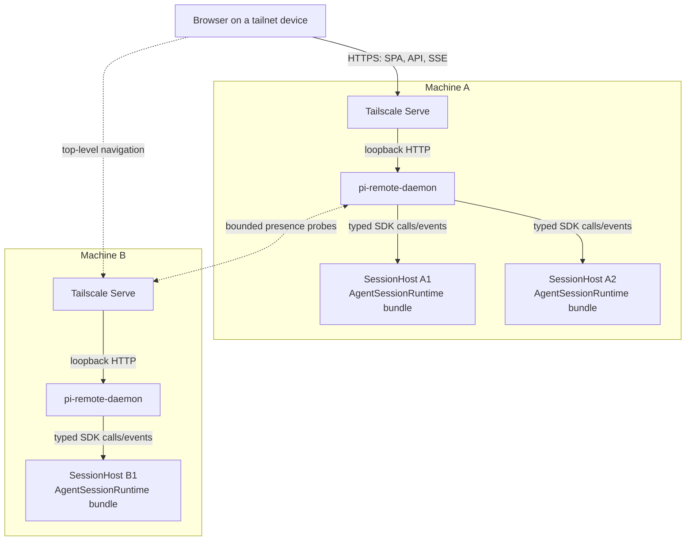
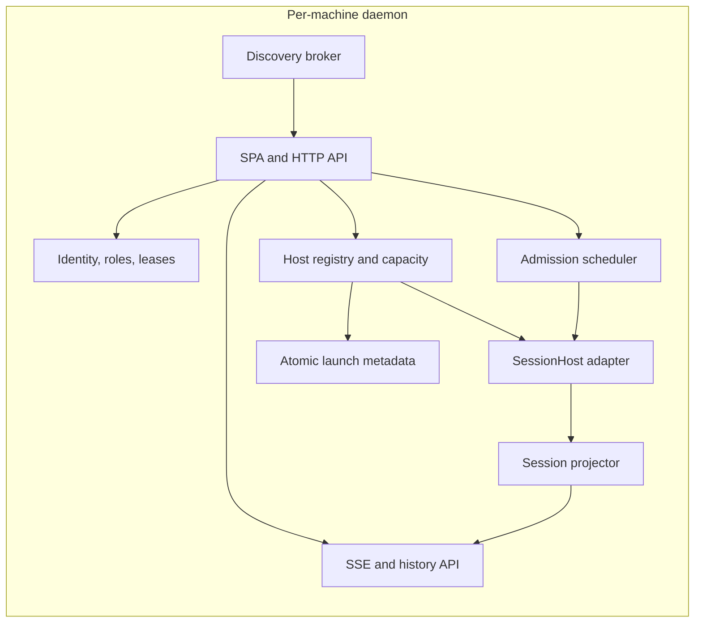
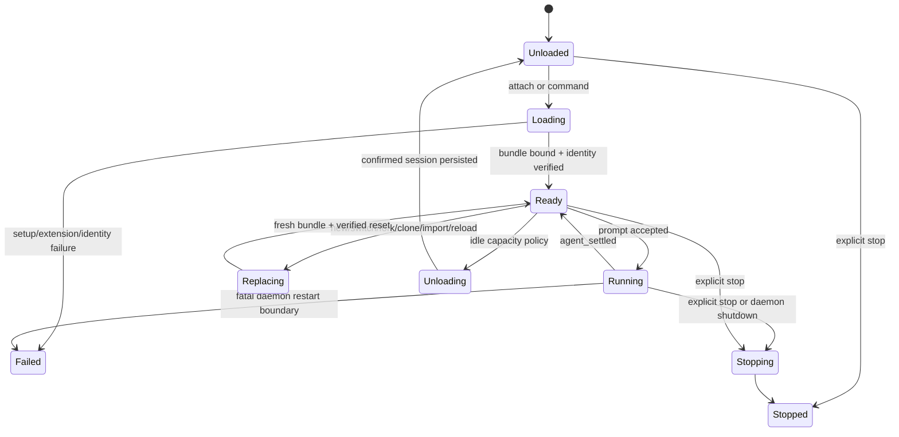
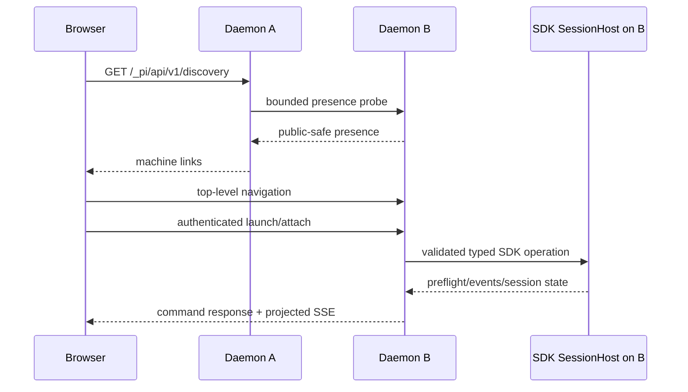

# SDK-hosted remote dashboard architecture

> The filename is retained to preserve existing links. Phase 0D superseded the original RPC-first process decision.

## Status and decision

This document is the source of truth for the cross-machine managed dashboard. It supersedes the managed child-web-server, reverse-proxy, iframe, and one-`pi --mode rpc`-child portions of [`REMOTE_SESSION_INFRA_PLAN.md`](./REMOTE_SESSION_INFRA_PLAN.md).

The decision is:

> A per-machine daemon initially hosts a bounded number of typed Pi `AgentSessionRuntime` bundles in-process. The daemon serves the dashboard, authenticates browser requests, projects sessions, and maps validated commands to public Pi SDK methods. A host-neutral adapter preserves migration to process-isolated typed SDK workers if operational evidence requires stronger fault containment.

The standalone `web-ui` extension remains the browser companion for a Pi process the user started directly, especially an existing TUI session. The daemon never imports that extension.

Evidence, measurements, lifecycle findings, and safeguards are recorded in [`../../../../apps/remote-session-daemon/docs/SDK_HOSTING_EVALUATION.md`](../../../../apps/remote-session-daemon/docs/SDK_HOSTING_EVALUATION.md).

## Why SDK hosting wins initially

The daemon is the sole controller in either model. Typed SDK hosting removes:

- per-launch child startup and readiness negotiation;
- JSONL framing, parser limits, protocol desynchronization, and stderr plumbing;
- request correlation and stdin writer locking;
- RPC command serialization and reconstruction of typed Pi state;
- unbounded `get_entries` transfers and duplicate loaded-session parsing/index pressure.

It provides direct typed access to:

- prompt preflight admission, queues, abort, model, thinking, compaction, and events;
- `SessionManager` entries, tree, branch, and persisted identity;
- `AgentSessionRuntime` new/switch/fork/clone/import replacement paths;
- extension runners, commands, tools, providers, and diagnostics.

RPC has stronger accidental per-launch fault containment. The measured `/crash` probe confirms that `process.exit()` in one SDK runtime terminates the whole daemon, whereas an RPC child crash leaves its sibling alive. The initial product accepts that tradeoff only for a small trusted extension profile, bounded loaded-session count, external supervision, idle unloading, reconnectable clients, and recovery without prompt replay.

## Product modes

| Mode                   | Owner              | Browser backend    | Control path                       | Intended use                                           |
| ---------------------- | ------------------ | ------------------ | ---------------------------------- | ------------------------------------------------------ |
| Standalone companion   | User/TUI           | `web-ui` extension | Public extension APIs              | Attach to an already-running local Pi process          |
| Managed remote session | Per-machine daemon | Per-machine daemon | Typed Pi SDK through `SessionHost` | Launch, resume, and control approved sessions remotely |

Feature parity is not automatic. Shared browser DTOs and components define presentation parity; host capability flags define intentional behavior differences.

## Repository and package boundary

```text
~/.pi/
  package.json
  agent/
    extensions/web-ui/                  standalone host adapter
  packages/pi-web-ui-client/            host-neutral UI, schemas, reducers, fixtures
  apps/remote-session-daemon/           managed SDK host, API, discovery, service
```

Both hosts depend on `@dotfiles/pi-web-ui-client` through `workspace:*`. The shared package imports no Pi APIs, extension implementations, Node HTTP/process APIs, Tailscale code, or daemon code.

The daemon imports public Pi SDK exports and the shared client package. It does not import `web-ui`, Agentflow runtime classes, background-process runtime classes, or daemon code from extensions. Agentflow and background processes remain ordinary explicitly loaded Pi extensions and publish bounded provider contracts over their host-owned event bus.

Implementation plans:

- [`../PLAN.md`](../PLAN.md) — standalone extension and shared client extraction;
- [`../../../../apps/remote-session-daemon/PLAN.md`](../../../../apps/remote-session-daemon/PLAN.md) — daemon implementation.

## Topology



One unprivileged daemon runs per machine under `systemd --user` or a macOS LaunchAgent. Tailscale Serve forwards one persistent HTTPS endpoint to its fixed loopback listener. Funnel is not used.

A loaded launch owns one complete session-host bundle:

- `AgentSessionRuntime` and current `AgentSession`;
- settings and model runtimes;
- resource loader and extension runner;
- event bus and provider bindings;
- daemon event subscriptions and projection state.

No bundle component is shared across launches except immutable module code. Idle launches may unload their bundle and retain only confirmed persisted metadata. Reopening creates a fresh bundle and browser generation.

## Exact extension profile

Managed hosts use `noExtensions: true` with only:

- `agent/extensions/agentflow/src/index.ts`;
- `agent/extensions/background-processes/src/index.ts`.

They bind extensions with SDK mode `rpc` and daemon-owned UI/command actions. This mode is required because background-process tools reject `json` and `print`. A repeatable credential-free fixture proves Agentflow status plus background launch, stop, and status through the public SDK without importing `runRpcMode`.

The initial profile excludes:

- automatic global/project discovery and optional npm/git packages;
- standalone `web-ui` and Tailscale listener ownership;
- boxed editor, custom header/footer/status, tool selector, and other TUI-only UI;
- questionnaire TUI, notification/focus integrations, and Herdr;
- automatic session naming and diagnostic-only extensions.

Optional extensions require a separate lifecycle, process-global-state, UI, resource, and fatal-failure audit before admission.

## Daemon components



### Host registry

Owns approved-root and project-trust policy, launch idempotency, loaded-host capacity, idle unloading, stable launch IDs, host/session generations, recovery, and complete bundle disposal.

### SessionHost adapter

This is the only daemon layer allowed to consume Pi SDK types. It exposes daemon-owned typed operations for:

- state and capability snapshots;
- prompt admission and eventual lifecycle events;
- steer, follow-up, abort, model, thinking, and compaction;
- bounded entries/tree access;
- new, switch, fork, clone, import, reload, unload, and stop;
- standard dialog requests/responses when later enabled.

HTTP, authentication, persistence, and browser code never receive `AgentSession`, `AgentSessionRuntime`, `SessionManager`, extension runner, or raw Pi event objects. A fake host and a future process-isolated typed SDK worker implement the same adapter contract.

### Admission scheduler

Browser mutations remain serialized by daemon policy even though there is no RPC writer lock.

- One ordinary mutation admission decision is pending per launch.
- Abort, dialog cancellation/response, lease revocation, and lifecycle stop form an interrupt path.
- Admission is fenced during replacement, unload, recovery, and generation reset.

Every mutation is checked immediately before SDK invocation for principal, role, generation, lease, replay ID, payload bounds, and host state.

For ordinary model prompts, `session.prompt()` completion is not admission. The daemon starts the promise, answers accepted/queued only from `preflightResult(true)`, answers preflight rejection only from `preflightResult(false)`, and reports later failure or `agent_settled` through projected events. Pi 0.82.1 invokes handled extension-command preflight only after the command handler completes, so handled-command responses are completion-bound and must not be assumed to precede side effects. No ambiguous accepted prompt is retried.

### Session projector

Consumes typed session events and `SessionManager` state and emits only shared browser DTOs. It owns durable projected entries, live assistant/tool overlays, queues, retries, compaction, model/thinking/cost state, monotonic revision, reset semantics, hostile-content projection, explicit truncation, and bounded SSE replay/coalescing.

Pi JSONL remains transcript truth. Daemon metadata is disposable and never becomes a duplicate transcript database.

## Host lifecycle and generation

| Identifier                  | Lifetime               | Purpose                                                          |
| --------------------------- | ---------------------- | ---------------------------------------------------------------- |
| `daemonId`                  | Installation           | Stable discovery identity                                        |
| `daemonBootId`              | Daemon process         | Detect daemon-wide restart                                       |
| `launchId`                  | Managed launch slot    | Stable route; never a credential                                 |
| `hostEpoch`                 | Loaded SDK bundle      | Changes on load, unload/reopen, reload, or conservative recovery |
| `sessionEpoch`              | Active Pi session/view | Changes on new/switch/fork/clone/import or reset                 |
| `generation`                | Opaque client token    | Combines host/session epochs                                     |
| `revision`                  | One generation         | Monotonic browser operation sequence                             |
| `sessionId` / `sessionFile` | Pi session             | Transcript/recovery identity, not authorization                  |



### Initial load and reopen

1. Validate root alias, relative cwd, realpath containment, and trust policy.
2. Allocate capacity and a new host epoch.
3. Create independent settings/model/resource-loader/event-bus services.
4. Load exactly the managed extension paths and reject diagnostics or path drift.
5. Create `AgentSessionRuntime` for a new or validated persisted session.
6. Bind daemon subscriptions, provider listeners, RPC-mode extension UI/actions, and projection.
7. Verify session ID/file and publish one ready generation/reset.

Idle reopen never emits `agent_start`, restores no volatile queue, and never replays a prompt.

### Session replacement

`newSession()`, `switchSession()`, `fork()`, clone via `fork(..., { position: "at" })`, and `importFromJsonl()` are fenced typed operations.

The runtime factory creates a fresh loader, services, model runtime, event bus, extension runner, and bindings for every replacement. The current `AgentSessionRuntime` contract is destructive: it shuts down/disposes the old session before it awaits replacement creation. The adapter therefore fences the launch, keeps candidate bus/bindings private until success, and never promises rollback to the old session.

After success:

1. verify cancellation and expected session identity;
2. publish the replacement runtime's bus/bindings through the adapter;
3. clear only the retired event bus;
4. increment session epoch and publish one reset;
5. verify sibling hosts are unchanged.

If create/load/bind/identity verification fails, clean the candidate resources, clear its bus, move the launch to a failed/recovery state, and preserve no stale generation. Phase 0D proves bus ownership on successful paths; Phase 5 injects every destructive failure boundary.

A fixed shared bus is forbidden: the Phase 0D spike measured listener growth from two to twelve across replacement paths. Successful-path bus rotation keeps the active bundle at exactly two managed providers and clears each retired bus to zero.

### Reload

Managed reload is idle-only complete host replacement. It does not call `session.reload()`.

1. Require no streaming, compaction, pending messages, or unresolved dialog.
2. Fence admission and invalidate the generation.
3. Persist only last-confirmed session identity.
4. create and verify a fresh complete bundle;
5. dispose the old bundle and clear its bus;
6. publish a new host epoch and reset.

The installed Pi version may allow in-place reload only after the scoped `pi.events.on()` cleanup MRE proves one current listener set, stale API invalidation, sibling preservation, and zero retired listeners after disposal.

## Browser server and topology

Each daemon serves:

```text
/_pi/                                  dashboard SPA
/_pi/api/v1/host                       host identity/capabilities
/_pi/api/v1/discovery                  bounded daemon discovery
/_pi/api/v1/roots                      approved-root summaries
/_pi/api/v1/sessions                   local launch/session summaries
/_pi/api/v1/sessions/:launchId/events  projected SSE
/_pi/api/v1/sessions/:launchId/history bounded history pages
/_pi/api/v1/sessions/:launchId/command explicit typed commands
/_pi/api/v1/sessions/:launchId/lease   controller lease
/_pi/api/v1/sessions/:launchId/stop    lifecycle operation
/_pi/api/v1/sessions/:launchId/dialog  later dialog response
/_pi/daemon/v1/presence                public-safe daemon marker
```

The browser remains same-origin with the daemon it is using. Selecting another discovered machine performs top-level navigation or opens a new tab. There are no iframes, child reverse proxies, transcript CORS, delegated identity forwarding, or central transcript proxy.



All managed and standalone pages default to `frame-ancestors 'none'`.

## Transcript and history

Typed events drive the live tail. `agent_settled`, not `agent_end`, is the fully idle boundary. Durable entries reconcile from the active `SessionManager` after turns and uncertainty boundaries.

SSE emits bounded reset snapshots, durable appends, replaceable live/status operations, generation, and monotonic revision. Slow clients never block session or tool event processing; replaceable operations coalesce, continuity loss forces a reset, and clients unable to accept it disconnect.

Direct `SessionManager` access removes RPC serialization and a second loaded-session parse, not browser limits. The adapter:

- bounds projected entry count, bytes, images, and tool output;
- returns opaque history cursors tied to session identity and branch epoch;
- slices only bounded pages from already loaded entries;
- reports explicit degraded history beyond supported limits;
- loads an idle host on demand only under capacity policy.

A separate JSONL offset index is deferred. Add one only if realistic large-session measurements show that bounded slices from a loaded manager or on-demand host loading cannot meet memory/latency limits. Any index remains disposable and version-checked.

## Dialogs and provider UI

Arbitrary `ctx.ui.custom()` is not serialized. Agentflow/background dashboards and questionnaire experiences are explicit shared browser components backed by bounded provider DTOs and typed actions.

Standard `select`, `confirm`, `input`, and `editor` can later use a daemon-owned SDK UI context. Phase 1 cancels unsupported blocking dialogs. Browser answering requires launch/generation/request/lease/deadline scope, exactly one terminal result, interrupt-path delivery, cleanup on every disconnect/replacement/shutdown path, and late/duplicate rejection.

Managed hosts exclude Herdr. Autonomous daemon computation is never reported as a blocked TUI pane.

## Tailscale discovery

A seed daemon runs fixed `tailscale status --json` under timeout/output caps, derives only canonical visible MagicDNS candidates, and probes only the fixed HTTPS presence path.

Rules:

- candidates never come from browser input;
- tolerate unknown/missing status fields and pin supported versions;
- cap candidates, concurrency, timeout, redirects, body size, and cache lifetime;
- validate TLS, content type, exact kind marker, and protocol version;
- presence exposes no sessions, cwd, users, models, roles, credentials, or private capabilities;
- reachability is not authorization;
- the selected daemon independently authenticates the browser.

Initial limits: 256 candidates, eight concurrent probes, 2–3 seconds each, 4 KiB bodies, 10–15 second cache, and 15–30 second browser refresh. Manual host entry and cached links remain fallback bootstrap.

## Authentication and authorization

Tailscale Serve terminates HTTPS and supplies supported identity headers to the loopback backend. The daemon:

- listens on loopback only and never uses Funnel;
- trusts headers only under the explicit single-user/local-host assumption;
- denies missing, malformed, tagged, or shared identities unless policy maps them;
- combines Tailscale policy with daemon viewer/controller/launcher/operator roles;
- requires exact external Origin on every mutation;
- uses no mutating GET, wildcard CORS, or origin reflection;
- treats launch IDs, session IDs, reachability, and approved cwd as non-authorizing.

Many viewers may attach; one renewable controller lease mutates a launch. Lease loss, generation change, authorization loss, or daemon restart invalidates control.

Remote control and extensions execute as the daemon Unix account. Approved roots are launch policy, not a sandbox. Mutually untrusted users or repositories require OS-account, container, or VM isolation.

## Persistence and recovery

Persist owner-only metadata atomically:

- daemon identity;
- launch ID/creator and desired running/stopped state;
- root alias, relative cwd, and canonical validation data;
- launch idempotency;
- last confirmed Pi session ID/file;
- bounded timestamps and recovery state.

Do not persist leases, prompts, volatile queues, raw events, tool output, credentials, or ambiguous commands for replay.

After daemon restart, revalidate root, cwd, trust, and session identity. Desired-running launches remain unloaded until attach or policy loads them. Recovery opens only the last confirmed session in a fresh host. It does not resume active model work, adopt unknown extension tool processes, or replay kickoff prompts. Browser boot/generation changes force reconnect and reset.

## Reliability invariants

1. One daemon process per machine and one independent complete SDK host bundle per loaded launch.
2. Only the exact audited extension profile loads; project/package discovery is disabled.
3. Pi SDK objects never cross the `SessionHost` adapter.
4. Every mutation is authenticated, authorized, Origin-, generation-, replay-, bound-, and lease-checked immediately before invocation.
5. Prompt preflight admission is distinct from eventual completion; ambiguous accepted work is never retried.
6. Browser slowness never blocks session/tool event processing.
7. Reload and every session replacement rotate the complete bundle and event bus; `session.reload()` is forbidden.
8. Pi JSONL is transcript truth; browser projections and metadata are disposable.
9. Loaded hosts, queues, projections, history pages, images, logs, bodies, rates, and discovery probes have hard limits.
10. External supervision restarts daemon-wide fatal exits; clients detect boot/generation changes.
11. Recovery restores confirmed idle identity only and never replays volatile work.
12. Presence proves reachability only; the selected daemon authorizes again.
13. Strict CSP, `nosniff`, no-referrer, hostile Markdown sanitization, and URL-scheme allowlisting gate remote mutation.
14. The local-host Tailscale header trust limitation remains explicit.

## Milestones

1. **Contracts and feasibility** — shared browser envelopes, SDK host adapter, exact-profile/replacement fixtures, measured limits, Tailscale identity/SSE validation.
2. **Local host core** — one bounded SDK host, root policy, load/unload/replacement, typed admission, fake host tests.
3. **Managed session view** — shared client through managed transport and typed projector.
4. **History and lifecycle** — bounded manager-backed pages, transitions, complete-host reload, restart recovery.
5. **Remote security and discovery** — identity, roles, Origin, generation, lease, replay, presence probes, direct navigation.
6. **Optional interactions** — standard dialogs, notifications, or read-only fleet summaries after explicit gates.

## Revisit conditions

Move execution behind the same adapter to one process-isolated typed SDK worker per loaded session when:

- a runtime can block, crash, call `process.exit`, or exhaust the daemon often enough to harm usability;
- arbitrary third-party/project extensions become a managed requirement;
- measured concurrency exceeds safe RSS or event-loop limits;
- per-session hard kill, accounting, or independent restart becomes required;
- native dependencies create unacceptable daemon-wide risk.

Use CLI RPC children only if public typed SDK hosting cannot provide a required managed capability or if RPC is the fastest safe fallback. Prefer typed workers when direct typed history/state remains valuable.

Other revisits:

- permit in-place reload only after the installed Pi version passes scoped event-bus cleanup fixtures;
- add a JSONL index only after measured history needs require it;
- add exact-origin read-only fleet-summary CORS only after top-level navigation proves insufficient;
- add a central proxy only for a new archival/search/audit product with a separate security design;
- use containers, VMs, or separate users for mutually untrusted workloads.

## Decision summary

- Keep `web-ui` as the standalone companion.
- Build one daemon per machine with bounded in-process typed SDK session hosts.
- Load exactly Agentflow and background-processes under daemon-owned RPC-mode bindings.
- Rotate the complete host bundle and event bus on every replacement or reload.
- Keep Pi SDK types behind a host-neutral adapter.
- Serve the shared session SPA directly from every daemon.
- Navigate directly to the selected machine; no iframes or transcript proxy.
- Keep transcript and mutation traffic on the owning machine.
- Supervise the daemon externally, restore confirmed idle sessions only, and never replay ambiguous prompts.
- Migrate to process-isolated typed SDK workers when measured fault or scale triggers require it.
