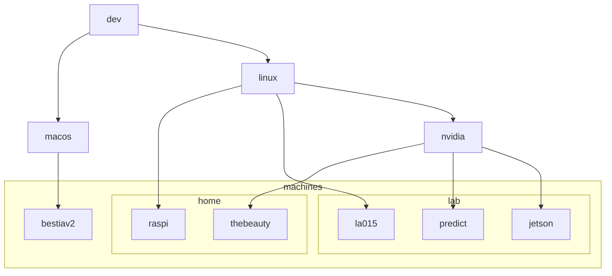

# Manage a workstation with mise

Use mise as the entry point for the configuration you intentionally own: host packages, user tools, repositories, dotfiles, shell setup, and agent configuration. Leave credentials, caches, application state, and other machine-local data unmanaged.
curl -fsSL https://mise.run | sh
This guide assumes that the dotfiles repository becomes the global mise configuration directory, normally `~/.config/mise`.

## Repository layout

```text
~/.config/mise/                 # Git checkout
├── .gitignore
├── config.toml                 # common user configuration
├── config.unix.toml            # automatic platform overlay
├── config.macos.toml
├── config.macos-arm64.toml
├── config.linux.toml
├── config.linux-x64.toml
├── config.dev.toml             # explicit role overlay
├── config.server.toml
├── config.nvidia.toml
├── miserc.toml                 # local machine role; do not commit
├── dotfiles/
│   ├── gitconfig
│   ├── tmux.conf
│   └── nvim/
├── tasks/
├── scripts/
└── agents/
    ├── shared-skills/
    ├── codex/
    └── claude/
```

Ignore local selection and secrets:

```gitignore
miserc.toml
*.local.toml
.env
```

Use whole-file dotfiles for files you own. Use named blocks for cooperative files such as `.zshrc`. Do not manage tokens, login state, caches, histories, or machine-generated trust records.

## Stage 0 on a fresh Mac

Mise cannot install itself. Xcode Command Line Tools also sit outside the reliable declarative bootstrap path because installation can require an Apple dialog and a completed system install.

```sh
# Check first. If this fails, request the Command Line Tools installer.
xcode-select -p || xcode-select --install

# Wait for the installation to finish, then verify it.
xcode-select -p
git --version

# Install mise without Homebrew and expose it in this shell.
curl -fsSL https://mise.run | sh
export PATH="$HOME/.local/bin:$PATH"
mise --version
```

For a public repository:

```sh
mise bootstrap --adopt https://github.com/YOU/dotfiles.git --dry-run
mise bootstrap --adopt https://github.com/YOU/dotfiles.git
```

For a private repository, configure an SSH key or GitHub authentication before `--adopt`:

```sh
mise use -g gh
mise x gh -- gh auth login --hostname github.com --git-protocol https --web
mise x gh -- gh auth setup-git --hostname github.com
mise bootstrap --adopt YOU/dotfiles
```

`--adopt` clones a global-config repository into `~/.config/mise` and uses it immediately. Use `mise bootstrap --from <url>` instead when a repository contains a standalone `mise.toml` bootstrap project that should live elsewhere.

Mise can install `brew:` formulae and `brew-cask:` applications without an existing Homebrew installation. Install the `brew` command itself only if you want it for interactive use.

## Select the machine role

Put early configuration discovery settings in the machine-local `~/.config/mise/miserc.toml`:

```toml
# Developer Mac
auto_env = true
env = ["dev"]
```

```toml
# NVIDIA development workstation
auto_env = true
env = ["dev", "nvidia"]
```

```toml
# Server
auto_env = true
env = ["server"]
```

With `auto_env = true`, mise adds platform environments before explicit ones:

```text
Apple Silicon developer Mac: base + unix + macos + macos-arm64 + dev
x64 NVIDIA Linux workstation: base + unix + linux + linux-x64 + dev + nvidia
x64 Linux server:             base + unix + linux + linux-x64 + server
```

Later overlays take precedence. Dots in a filename do not define inheritance. `config.dev.linux.nvidia.toml` is not a chain through `dev`, `linux`, and `nvidia`; compose the three environments instead:

```sh
mise -E dev,linux,nvidia config
```

Use platform overlays for platform facts and semantic overlays for roles. Run `mise config` to inspect the files that mise loaded.

## Base configuration

`~/.config/mise/config.toml` can hold common resources:

```toml
[settings]
lockfile = true

[bootstrap.user]
login_shell = "/bin/zsh"

[bootstrap.mise_shell_activate]
zprofile = "shims"
zshrc = "activate"

[dotfiles]
"~/.zprofile/local-bin" = { block = 'export PATH="$HOME/.local/bin:$PATH"' }
"~/.gitconfig" = { source = "dotfiles/gitconfig", mode = "symlink" }
"~/.tmux.conf" = { source = "dotfiles/tmux.conf", mode = "symlink" }
"~/.config/nvim" = { source = "dotfiles/nvim", mode = "symlink" }
"~/.codex/skills" = { source = "agents/shared-skills", mode = "symlink-each" }

[tools]
python = "3.13"
node = "24"
bun = "latest"

# Explicit upstream GitHub release backends.
"github:neovim/neovim" = "latest"
"github:aristocratos/btop" = "latest"
"github:junegunn/fzf" = "latest"
"github:sharkdp/fd" = "latest"
"github:BurntSushi/ripgrep" = "latest"
"github:jesseduffield/lazygit" = "latest"
```

The GitHub backend selects a release asset for the current operating system and architecture. If a project publishes unusual assets, add `matching`, `asset_pattern`, `bin_path`, or another backend option. Registry shorthands may be cleaner when they use the source you want:

```sh
mise registry ripgrep
mise ls-remote github:BurntSushi/ripgrep
```

Create the global lockfile after the initial configuration:

```sh
mise lock --global
```

Commit the generated lockfile with the configuration. It records concrete versions and, where supported, artifact URLs and checksums.

## Platform packages and bootstrap resources

Keep macOS packages in `config.macos.toml`:

```toml
[bootstrap.packages]
"brew:git" = "latest"
"brew:jq" = "latest"
"brew:openssl@3" = "latest"
"brew-cask:wezterm" = "latest"
"brew-cask:1password" = "latest"
```

Keep Debian or Ubuntu packages in `config.linux.toml`:

```toml
[bootstrap.packages]
"apt:build-essential" = "latest"
"apt:curl" = "latest"
"apt:libssl-dev" = "latest"
"apt:zsh" = "latest"
```

Use `[bootstrap.packages]` for software that belongs to the host package database or a shared prefix. Use `[tools]` for versioned, user-facing tools that mise should place on its managed `PATH`.

Other native bootstrap resources include repositories, files and directories, services, macOS defaults and LaunchAgents, Linux systemd units, accounts, firewall rules, and a final task. Keep privileged or system-wide resources in a separate semantic environment such as `admin`:

```toml
# config.admin.toml
[bootstrap.packages]
"apt:build-essential" = { version = "latest", os = "linux" }
```

Do not select `admin` on a shared machine unless you own the system configuration.

## Make `.zshrc` cooperative

A whole-file symlink works for a file that only you edit:

```toml
[dotfiles]
"~/.gitconfig" = { source = "dotfiles/gitconfig", mode = "symlink" }
```

Edits made through that symlink change the Git-controlled source. A copied or rendered whole file has the opposite risk: a later apply overwrites live edits.

Keep `.zshrc` as a regular file and let mise own named blocks. Put the common block in `config.toml`:

```toml
[dotfiles]
"~/.zshrc/base" = { block = '''
alias ll='ls -la'
export EDITOR=nvim
''' }
```

Add role-specific blocks in the matching overlays:

```toml
# config.dev.toml
[dotfiles]
"~/.zshrc/dev" = { block = '''
export CMAKE_GENERATOR=Ninja
''' }
```

```toml
# config.nvidia.toml
[dotfiles]
"~/.zshrc/nvidia" = { block = '''
export CUDA_CACHE_PATH="$HOME/.cache/cuda"
''' }
```

Mise replaces only the text between each block's markers. An installer may append `eval "$(some-tool init zsh)"` elsewhere in `.zshrc`; both changes survive the next bootstrap. If that line belongs in the reproducible setup, move it into a named block and delete the unmanaged copy.

Do not combine whole-file management of `.zshrc` with block edits to that path. Mise also rejects edit entries whose target is a symlink.

`[bootstrap.user]` changes the account's login shell with `chsh`; it does not install zsh or activate mise. `[bootstrap.mise_shell_activate]` adds marker-owned activation blocks. Open a new login shell after either changes.

## Shared-machine safety

Run mise as your own account. Dotfiles and mise tools normally stay under your home directory:

```text
~/.config/mise/       configuration repository
~/.local/share/mise/  installed tools and mise data
~/.zshrc              your shell configuration
~/.config/            your application configuration
```

Other users remain unaffected. System packages, `/etc` files, account changes, system services, and some cask installers can require `sudo` and can affect everyone. Keep those resources out of common, `dev`, `server`, and `nvidia` overlays. To forbid mise from elevating on a shared host, add this to the ignored machine-local `~/.config/mise/config.local.toml`:

```toml
[settings]
system_packages.sudo = false
```

## Preview and converge

Use this loop after each configuration change:

```sh
mise bootstrap status
mise bootstrap status --missing
mise bootstrap --dry-run
mise bootstrap
```

Narrow the run while developing one part:

```sh
mise bootstrap --only dotfiles,tools --dry-run
mise bootstrap --only dotfiles,tools
mise bootstrap dotfiles diff
mise bootstrap dotfiles status
```

Bootstrap compares declared resources with the host and applies missing or different state. It is additive by default: unrelated packages, files, and tools remain. Removing a declaration does not usually remove the installed resource. Use explicit `unapply` or manager-specific `prune` commands only after reviewing their dry run.

Bootstrap is a sequence, not a transaction. If a later phase fails, earlier changes remain. Fix the error and run it again. Declarative phases skip resources that already match. Hooks and the task named `bootstrap` run on every apply, so make them safe to repeat. A dry run skips hooks and the final task.

## Add and update tools without hand-editing TOML

```sh
# Add a tool to the global base config and install it.
mise use -g github:owner/project@latest

# Add a tool to the global dev overlay.
mise -E dev use -g github:owner/project@latest

# Upgrade within each configured version range and update the lockfile.
mise upgrade

# Move one request to the newest release and rewrite its config entry.
mise upgrade --bump github:jesseduffield/lazygit

# Install the versions already declared or locked.
mise install
```

Without `--bump`, `mise upgrade` respects the configured range. For example, `"24"` stays on the newest Node.js 24 release. With `--bump`, mise advances the request, preserves its precision, rewrites the owning config, and updates an enabled lockfile.

## Synchronize the Git repository

Mise supports the remote-to-machine direction:

```sh
# First machine setup.
mise bootstrap --adopt git@github.com:YOU/dotfiles.git

# Later runs: update package metadata and eligible Git checkouts, then converge.
mise bootstrap --update
```

Repository updates require a clean enough worktree and a fast-forward update. Mise does not auto-commit and push edits that `mise use`, `mise upgrade --bump`, or your editor makes in the adopted `~/.config/mise` checkout. Mise also has a separate dotfile-history repository with optional automatic synchronization. That is a different storage model and is not part of this architecture.

Keep Git publication explicit, or add this opt-in task to `config.toml`. It commits every change in the config repository, so inspect `git status` before approving it:

```toml
[tasks.publish-config]
description = "Commit and push workstation configuration"
confirm = "Commit and push every change in ~/.config/mise?"
dir = "{{ env.HOME }}/.config/mise"
run = '''
#!/usr/bin/env bash
set -eu
git status --short
git add -A
git diff --cached --quiet && exit 0
git commit -m "Update workstation configuration"
git push
'''
```

```sh
mise run publish-config
```

A less surprising default is to stop after `git commit` and push manually, especially when several machines can change the repository.

## Migrate progressively

1. Install mise and adopt the repository.
2. Add `miserc.toml` with the machine's roles.
3. Enable zsh login-shell setup and mise activation.
4. Move a few user tools into `[tools]`; create and commit the lockfile.
5. Add host packages to platform overlays.
6. Adopt files you fully own as symlinks:

   ```sh
   mise bootstrap dotfiles add ~/.gitconfig
   mise bootstrap dotfiles add ~/.tmux.conf
   ```

7. Convert `.zshrc` fragments into named blocks one at a time.
8. Add agent skills and portable agent configuration. Exclude credentials and machine-generated state.
9. Add repositories, applications, services, and operating-system settings only when each one earns its place.
10. Run `status`, a dry run, and bootstrap on every machine before publishing the config change.

## Everyday commands

```sh
mise config                            # show composed configuration
mise doctor                            # diagnose mise and shell setup
mise bootstrap status                  # inspect declared host state
mise bootstrap status --missing        # exit nonzero when state differs
mise bootstrap --dry-run               # preview the full apply
mise bootstrap                         # converge the machine
mise bootstrap --update                # fetch updates, refresh metadata, converge
mise bootstrap dotfiles diff           # inspect dotfile drift
mise bootstrap dotfiles add <path>     # adopt or capture a file
mise install                           # install declared tools
mise outdated                          # list tool updates
mise upgrade                           # upgrade inside configured ranges
mise upgrade --bump <tool>             # advance and rewrite a request
mise use -g <tool>@<version>            # add or change a global tool
mise -E dev use -g <tool>@<version>     # write to the dev overlay
mise lock --global                     # resolve the global lockfile
mise run publish-config                # opt-in commit and push task
```

## Current documentation

- [Bootstrap](https://mise.jdx.dev/bootstrap.html)
- [Configuration environments](https://mise.jdx.dev/configuration/environments.html)
- [Dotfiles](https://mise.jdx.dev/dotfiles.html)
- [Bootstrap packages](https://mise.jdx.dev/bootstrap/packages/)
- [Shell activation](https://mise.jdx.dev/bootstrap/shell.html)
- [GitHub backend](https://mise.jdx.dev/dev-tools/backends/github.html)
- [`mise.lock`](https://mise.jdx.dev/dev-tools/mise-lock.html)

Bootstrap is evolving quickly. Check these pages when upgrading mise or adding a resource type that is not already in this guide.

## My machines and envs


